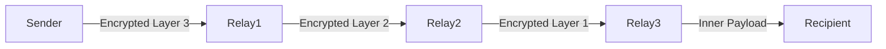
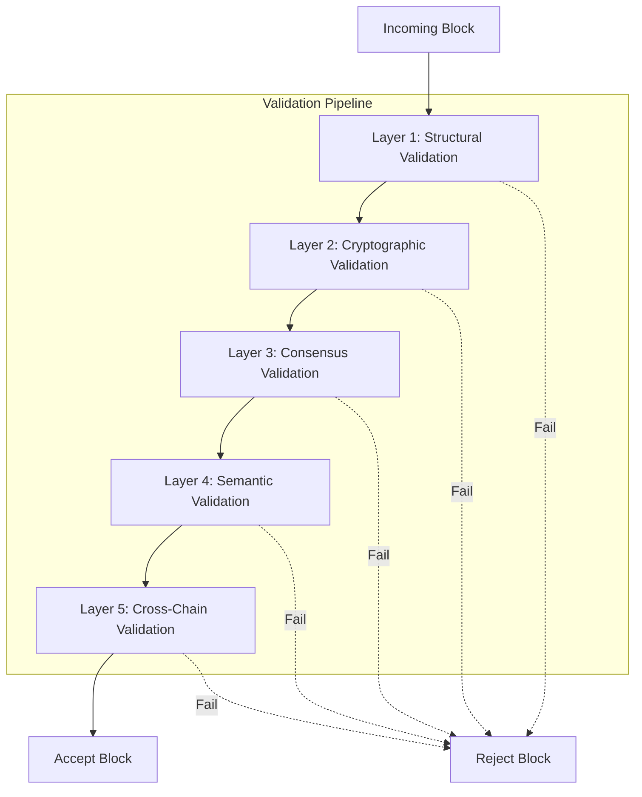

# Talos Protocol v2.0.0 Roadmap

**Codename: Argonaut**

> *The definitive security layer for the autonomous agent era.*

---

## Implementation Status

> **Current Version: 2.0.0-alpha.1** | **Tests: 196 passing** | **Date: December 2025**

| Phase | Feature | Status | Tests | Files |
|-------|---------|--------|-------|-------|
| 1 | Block Validation Engine | ✅ Complete | 19 | `src/core/validation/` |
| 2 | Double Ratchet Protocol | ✅ Complete | 16 | `src/core/session.py` |
| 3 | Fine-Grained ACLs | ✅ Complete | 16 | `src/mcp_bridge/acl.py` |
| 4 | Python SDK | ✅ Complete | 19 | `talos/` |
| 5 | Light Client Mode | ✅ Complete | 24 | `src/core/light.py` |
| 6 | DIDs/DHT | ✅ Complete | 41 | `src/core/did.py`, `src/network/dht.py` |
| 7 | Infrastructure | ✅ Complete | - | `Dockerfile`, `docker-compose.yml`, `deploy/helm/` |

---

## Executive Summary

Version 2.0.0 transforms Talos from a research prototype into a **production-grade, feature-complete security framework** for AI agent communication. This release focuses on five pillars:

1.  **Cryptographic Excellence**: Perfect Forward Secrecy, Post-Quantum Readiness
2.  **Decentralization**: DHT-based Peer Discovery, Onion-Routed Metadata
3.  **Performance & Scale**: Consensus-Free Append, Light Client Mode
4.  **Block Validation Engine**: Multi-Layer Validation, BFT, Zero-Knowledge Proofs
5.  **Developer Experience**: SDKs, Dashboard, Formal Verification

---

## I. Cryptographic Enhancements

### 1.1 Double Ratchet Protocol (Forward Secrecy)
**Priority**: P0 - Critical

**Current State**: Static X25519 keys per conversation.
**Target State**: Per-message key rotation using the Signal Double Ratchet algorithm.

| Component | Change |
|-----------|--------|
| `src/core/crypto.py` | Add `RatchetState` class, `ratchet_encrypt`, `ratchet_decrypt` |
| `src/core/session.py` | **[NEW]** Session state management with on-disk persistence |
| Wire Protocol | Add `SESSION_INIT` (X3DH handshake) and `RATCHET_KEY` headers |

**Security Benefit**: Compromised long-term key does NOT expose past messages.

---

### 1.2 Post-Quantum Hybrid Encryption
**Priority**: P1 - High

**Approach**: Hybrid X25519 + Kyber-768 (NIST PQC standard).

| New Dependencies | Notes |
|-----------------|-------|
| `pqcrypto` (liboqs bindings) | Kyber/ML-KEM implementation |

**Key Derivation** (Hybrid):
```
K_shared = HKDF(X25519(sk, pk) || Kyber.Decapsulate(c, sk_kyber))
```

**Migration**: Opt-in via `--pq-mode` flag initially; default in v2.1.

---

### 1.3 Key Rotation & Revocation
**Priority**: P1 - High

- **Automated Key Rotation**: Wallet regenerates signing/encryption keys on a schedule (e.g., monthly) and publishes updates.
- **Revocation List (CRL)**: Blockchain stores signed `KEY_REVOKED` entries; clients check before accepting.

---

## II. Decentralized Infrastructure

### 2.1 Decentralized Identity (DID)
**Priority**: P0 - Critical

**Current State**: Centralized `Registry Server` for peer discovery.
**Target State**: Self-sovereign identities using [W3C DID](https://www.w3.org/TR/did-core/).

| Component | Change |
|-----------|--------|
| `src/core/identity.py` | **[NEW]** DID document generation (`did:talos:<pubkey>`) |
| `src/network/dht.py` | **[NEW]** Kademlia DHT for DID resolution |
| `src/server/server.py` | Deprecate; becomes optional bootstrap node |

**Benefits**:
- Zero reliance on any server.
- DIDs can be anchored to multiple blockchains (Ethereum, Solana, etc.).

---

### 2.2 Onion Routing (Metadata Protection)
**Priority**: P1 - High

**Threat**: Even with E2E encryption, traffic analysis reveals *who talks to whom*.

**Solution**: 3-hop onion routing (similar to Tor).



| Component | Change |
|-----------|--------|
| `src/network/onion.py` | **[NEW]** Circuit creation, onion skin wrapping |
| `src/network/relay.py` | **[NEW]** Optional relay node mode (`talos relay`) |

---

### 2.3 Multi-Chain Anchoring
**Priority**: P2 - Medium

**Goal**: Notarize message hashes on public blockchains for immutable proof.

| Chain | Method | Cost |
|-------|--------|------|
| Ethereum/L2 | Batch Merkle root in `OP_RETURN` | ~$0.10/batch |
| Solana | Direct memo instruction | ~$0.0001/msg |
| Bitcoin | Taproot commitment | ~$0.50/batch |

**API**: `talos anchor --chain ethereum --batch-size 1000`

---

## III. Performance & Scalability

### 3.1 Light Client Mode
**Priority**: P0 - Critical

**Current State**: All nodes store full chain.
**Target State**: Clients only store block headers + SPV proofs for their messages.

| Component | Change |
|-----------|--------|
| `src/core/blockchain.py` | Add `LightBlockchain` class |
| Sync Protocol | Add `GET_HEADERS`, `GET_MERKLE_PROOF` messages |

**Storage Reduction**: ~99% for typical clients.

---

### 3.2 Sharding / Namespaces
**Priority**: P2 - Medium

**Concept**: Partition chain by `namespace` (e.g., per-organization, per-dApp).

- Nodes only sync namespaces they care about.
- Cross-namespace messages use anchoring proofs.

---

### 3.3 Streaming Optimizations
**Priority**: P1 - High

| Feature | Description |
|---------|-------------|
| **Chunked ACKs** | Acknowledge chunks in batches to reduce overhead |
| **Parallel Streams** | Multiple concurrent file transfers per peer |
| **Resume** | Resume interrupted transfers using stored chunk hashes |
| **Compression** | zstd compression before encryption (optional) |

---

## IV. MCP Security Extensions

### 4.1 Fine-Grained Authorization (ACLs)
**Priority**: P0 - Critical

**Current State**: Peer is either fully authorized or not.
**Target State**: Per-tool, per-resource permissions.

**Schema** (`permissions.yaml`):
```yaml
peers:
  <AGENT_PEER_ID>:
    tools:
      - "file_read"
      - "git_status"
    resources:
      - "//localhost/repo/**"
    deny:
      - "rm_*"
```

| Component | Change |
|-----------|--------|
| `src/mcp_bridge/acl.py` | **[NEW]** ACL parser and checker |
| `src/mcp_bridge/proxy.py` | Integrate ACL checks before forwarding |

---

### 4.2 Audit Log & Replay
**Priority**: P1 - High

- Every MCP request/response is logged with timestamp and signature.
- **Replay Mode**: Re-execute historical sessions for debugging.

---

### 4.3 Rate Limiting & Quotas
**Priority**: P1 - High

| Limit | Description |
|-------|-------------|
| Requests/min | Configurable per-peer cap |
| Data/day | Max bytes transferred per peer |
| CPU time | Limit tool execution time |

---

## V. Developer Experience

### 5.1 Python SDK
**Priority**: P0 - Critical

```python
from talos import TalosClient, SecureChannel

client = TalosClient.from_wallet("~/.talos/wallet.json")

async with SecureChannel(client, peer_id="abc123") as channel:
    response = await channel.send_mcp({
        "method": "tools/call",
        "params": {"name": "get_weather", "arguments": {"city": "NYC"}}
    })
    print(response)
```

---

### 5.2 TypeScript/Node.js SDK
**Priority**: P1 - High

Full feature parity with Python SDK for web/Node.js agents.

---

### 5.3 Dashboard UI
**Priority**: P2 - Medium

**Tech**: Next.js + Tailwind

**Features**:
- Peer status and connection map
- Message history browser (decrypted with local key)
- ACL editor
- Benchmark metrics

---

### 5.4 Formal Verification (ProVerif)
**Priority**: P1 - High

**Deliverable**: Machine-checkable proof of:
- **IND-CCA** security of encryption
- **Non-repudiation** of signed messages
- **Privacy** of onion routing

---

## VI. Infrastructure & Ops

### 6.1 Helm Chart & Docker
**Priority**: P0 - Critical

```bash
# Single-node deployment
docker run -p 8765:8765 talosprotocol/talos:2.0.0

# Kubernetes cluster
helm install talos talosprotocol/talos --set replicas=3
```

---

### 6.2 Observability
**Priority**: P1 - High

| Tool | Metrics |
|------|---------|
| Prometheus | Message latency, block mining time, peer count |
| OpenTelemetry | Distributed tracing for MCP requests |
| Grafana | Pre-built dashboards |

---

### 6.3 Testnet
**Priority**: P0 - Critical

- Always-on public testnet for developers.
- Faucet for test tokens (if incentive layer added).
- Explorer UI for browsing chain.

---

## VII. Block Validation Engine

### 7.1 Multi-Layer Validation Architecture
**Priority**: P0 - Critical

A comprehensive validation engine that ensures block integrity at every level.



| Layer | Checks | Failure Mode |
|-------|--------|--------------|
| **Structural** | JSON schema, field types, size limits | `MALFORMED_BLOCK` |
| **Cryptographic** | Hash integrity, signature verification, Merkle proofs | `CRYPTO_INVALID` |
| **Consensus** | PoW difficulty, timestamp bounds, chain continuity | `CONSENSUS_VIOLATION` |
| **Semantic** | Message format, duplicate detection, nonce uniqueness | `SEMANTIC_ERROR` |
| **Cross-Chain** | External anchor verification (if multi-chain enabled) | `ANCHOR_MISMATCH` |

---

### 7.2 Cryptographic Proof Verification
**Priority**: P0 - Critical

| Proof Type | Algorithm | Implementation |
|------------|-----------|----------------|
| **Block Hash** | SHA-256 double-hash | Verify `H(H(header))` matches `block.hash` |
| **Merkle Root** | Binary Merkle Tree | Recompute from all transactions |
| **PoW Target** | Leading zeros check | `hash < 2^(256-difficulty)` |
| **Signature** | Ed25519 batch verify | Verify all message signatures in parallel |
| **Chain Link** | Previous hash binding | `block.prev_hash == chain[n-1].hash` |

**Batch Verification** (Performance):
```python
# Verify N signatures in ~1.3x time of single verification
from src.core.validation import batch_verify_signatures
results = batch_verify_signatures(messages, signatures, public_keys)
```

---

### 7.3 Byzantine Fault Tolerant Validation
**Priority**: P1 - High

For networks with multiple validators, implement BFT consensus rules:

| Property | Guarantee |
|----------|-----------|
| **Safety** | No two honest nodes accept conflicting blocks |
| **Liveness** | Valid blocks are eventually accepted |
| **Fault Tolerance** | Tolerates up to `f` malicious nodes where `n ≥ 3f + 1` |

**Validation Quorum**:
```
Block accepted IFF: valid_signatures ≥ ⌈(2n + 1) / 3⌉
```

---

### 7.4 Zero-Knowledge Proof Support
**Priority**: P2 - Medium

Enable privacy-preserving validation using ZK-SNARKs:

| Use Case | ZK Circuit |
|----------|------------|
| **Balance Proofs** | Prove `balance ≥ X` without revealing balance |
| **Membership Proofs** | Prove message is in block without revealing content |
| **Range Proofs** | Prove timestamp within valid range |

| Component | Change |
|-----------|--------|
| `src/core/zk/circuits.py` | **[NEW]** Circom/Noir circuit definitions |
| `src/core/zk/prover.py` | **[NEW]** Proof generation |
| `src/core/zk/verifier.py` | **[NEW]** Constant-time verification |

---

### 7.5 Validation Engine API
**Priority**: P0 - Critical

```python
from talos.validation import ValidationEngine, ValidationResult, ValidationLevel

engine = ValidationEngine(
    difficulty=2,
    strict_mode=True,
    enable_zk=False,
    parallel_verify=True
)

# Validate single block
result: ValidationResult = await engine.validate_block(block)
if result.is_valid:
    chain.append(block)
else:
    logger.error(f"Validation failed: {result.errors}")

# Validate entire chain
chain_result = await engine.validate_chain(blocks, from_genesis=True)

# Get detailed report
report = engine.generate_audit_report(block)
```

| Component | Change |
|-----------|--------|
| `src/core/validation/__init__.py` | **[NEW]** Package init |
| `src/core/validation/engine.py` | **[NEW]** Main `ValidationEngine` class |
| `src/core/validation/layers.py` | **[NEW]** Individual validation layer implementations |
| `src/core/validation/proofs.py` | **[NEW]** Cryptographic proof verification |
| `src/core/validation/report.py` | **[NEW]** Audit report generation |

---

### 7.6 Real-Time Validation Metrics
**Priority**: P1 - High

| Metric | Description |
|--------|-------------|
| `validation_duration_ms` | Time to validate block (by layer) |
| `blocks_rejected_total` | Counter by rejection reason |
| `signature_verify_rate` | Signatures verified per second |
| `merkle_recompute_time` | Merkle root calculation time |

**Prometheus Export**:
```
talos_validation_duration_seconds{layer="cryptographic"} 0.0023
talos_blocks_rejected_total{reason="CRYPTO_INVALID"} 42
```

---

## Migration Guide (v1.x → v2.0.0)

| Breaking Change | Migration Path |
|-----------------|----------------|
| Wallet format v2 | Run `talos migrate-wallet` |
| Wire protocol v2 | Nodes auto-negotiate; 6-month v1 support |
| Registry deprecated | Switch to `--bootstrap` peers or DHT |

---

## Release Timeline (Proposed)

| Milestone | Date | Features |
|-----------|------|----------|
| **Alpha 1** | Q1 2025 | Double Ratchet, Validation Engine, Light Client, Python SDK |
| **Alpha 2** | Q2 2025 | DIDs/DHT, ACLs, BFT Validation, TypeScript SDK |
| **Beta** | Q3 2025 | Onion Routing, PQ Crypto, ZK Proofs, Dashboard |
| **RC1** | Q4 2025 | Formal Verification, Helm/Docker, Testnet |
| **GA 2.0.0** | Jan 2026 | Production Ready |

---

## Summary

Version 2.0.0 establishes Talos as **the** security backbone for the agentic future. By combining cutting-edge cryptography with a fully decentralized architecture, we enable AI agents to operate autonomously and securely—without any centralized trust.

> *Trust math, not servers.*
