# Talos Context Graph

This graph is generated from the current checked-out Talos source tree. It is intended to be the durable MVP context map for code navigation, planning, drift checks, and onboarding.

- Generated at: `2026-04-22T04:14:50+00:00`
- Generator: `scripts/python/generate_context_graph.py`
- Regenerate: `python3 scripts/python/generate_context_graph.py`
- Scope: submodule metadata, manifests, FastAPI routes, Next.js routes, README feature bullets, docs links, tests, and source-level internal references.

## System Graph

```mermaid
graph TD
  subgraph Contracts["Contracts"]
    contracts["contracts"]
    core["core"]
    libs_talos_config["libs<br/>talos-config"]
    proto["proto"]
  end
  subgraph Runtime_Services["Runtime Services"]
    services_ai_chat_agent["services<br/>ai-chat-agent"]
    services_ai_gateway["services<br/>ai-gateway"]
    services_aiops["services<br/>aiops"]
    services_audit["services<br/>audit"]
    services_configuration["services<br/>configuration"]
    services_gateway["services<br/>gateway"]
    services_governance_agent["services<br/>governance-agent"]
    services_mcp_connector["services<br/>mcp-connector"]
    services_terminal_adapter["services<br/>terminal-adapter"]
    services_ucp_connector["services<br/>ucp-connector"]
  end
  subgraph SDKs_And_Tools["SDKs And Tools"]
    sdks_go["sdks<br/>go"]
    sdks_java["sdks<br/>java"]
    sdks_python["sdks<br/>python"]
    sdks_rust["sdks<br/>rust"]
    sdks_typescript["sdks<br/>typescript"]
    tools_setup_helper["tools<br/>setup-helper"]
    tools_talos_tui["tools<br/>talos-tui"]
  end
  subgraph Operator_And_Public_UI["Operator And Public UI"]
    site_configuration_dashboard["site<br/>configuration-dashboard"]
    site_dashboard["site<br/>dashboard"]
    site_marketing["site<br/>marketing"]
  end
  subgraph Docs_Examples_Testing_Deploy["Docs Examples Testing Deploy"]
    docs["docs"]
    examples["examples"]
    api_testing["api-testing"]
    deploy["deploy"]
    scripts["scripts"]
  end
  src["src"]
  talos["talos"]
  api_testing -->|"black-box-tests"| services_ai_gateway
  api_testing -->|"black-box-tests"| services_audit
  contracts -->|"imports-or-bundles"| sdks_python
  contracts -->|"imports-or-bundles"| sdks_typescript
  core -->|"imports-or-bundles"| contracts
  core -->|"validates-against"| contracts
  core -->|"imports-or-bundles"| sdks_python
  deploy -->|"imports-or-bundles"| contracts
  deploy -->|"validates-against"| contracts
  deploy -->|"imports-or-bundles"| core
  deploy -->|"imports-or-bundles"| sdks_python
  deploy -->|"deploys"| services_ai_gateway
  deploy -->|"deploys"| services_audit
  deploy -->|"imports-or-bundles"| services_governance_agent
  deploy -->|"deploys"| site_dashboard
  docs -->|"imports-or-bundles"| contracts
  docs -->|"validates-against"| contracts
  docs -->|"imports-or-bundles"| core
  docs -->|"imports-or-bundles"| sdks_python
  docs -->|"imports-or-bundles"| sdks_typescript
  docs -->|"imports-or-bundles"| services_governance_agent
  examples -->|"imports-or-bundles"| contracts
  examples -->|"validates-against"| contracts
  libs_talos_config -->|"imports-or-bundles"| contracts
  libs_talos_config -->|"validates-against"| contracts
  scripts -->|"imports-or-bundles"| contracts
  scripts -->|"validates-against"| contracts
  scripts -->|"imports-or-bundles"| core
  scripts -->|"imports-or-bundles"| libs_talos_config
  scripts -->|"imports-or-bundles"| sdks_python
  scripts -->|"imports-or-bundles"| sdks_typescript
  scripts -->|"imports-or-bundles"| services_governance_agent
  sdks_go -->|"contract-vectors"| contracts
  sdks_go -->|"imports-or-bundles"| contracts
  sdks_go -->|"validates-against"| contracts
  sdks_go -->|"imports-or-bundles"| sdks_python
  sdks_java -->|"contract-vectors"| contracts
  sdks_java -->|"imports-or-bundles"| contracts
  sdks_java -->|"validates-against"| contracts
  sdks_java -->|"imports-or-bundles"| sdks_python
  sdks_python -->|"contract-vectors"| contracts
  sdks_python -->|"imports-or-bundles"| contracts
  sdks_python -->|"validates-against"| contracts
  sdks_rust -->|"contract-vectors"| contracts
  sdks_rust -->|"imports-or-bundles"| contracts
  sdks_rust -->|"validates-against"| contracts
  sdks_rust -->|"imports-or-bundles"| core
  sdks_rust -->|"uses-core-kernel"| core
  sdks_rust -->|"imports-or-bundles"| sdks_python
  sdks_typescript -->|"contract-vectors"| contracts
  sdks_typescript -->|"imports-or-bundles"| contracts
  sdks_typescript -->|"validates-against"| contracts
  sdks_typescript -->|"imports-or-bundles"| core
  sdks_typescript -->|"imports-or-bundles"| sdks_python
  services_ai_chat_agent -->|"imports-or-bundles"| contracts
  services_ai_chat_agent -->|"validates-against"| contracts
  services_ai_gateway -->|"imports-or-bundles"| contracts
  services_ai_gateway -->|"validates-against"| contracts
  services_ai_gateway -->|"loads-config"| libs_talos_config
  services_ai_gateway -->|"imports-or-bundles"| sdks_python
  services_ai_gateway -->|"emits-audit-events"| services_audit
  services_ai_gateway -->|"validates-capabilities"| services_governance_agent
  services_ai_gateway -->|"proxies-mcp-tools"| services_mcp_connector
  services_aiops -->|"imports-or-bundles"| contracts
  services_aiops -->|"validates-against"| contracts
  services_audit -->|"imports-or-bundles"| contracts
  services_audit -->|"validates-against"| contracts
  services_audit -->|"verifies-audit-schema"| contracts
  services_audit -->|"imports-or-bundles"| core
  services_audit -->|"imports-or-bundles"| libs_talos_config
  services_audit -->|"imports-or-bundles"| sdks_python
  services_configuration -->|"imports-or-bundles"| contracts
  services_configuration -->|"validates-against"| contracts
  services_configuration -->|"validates-config-schema"| contracts
  services_configuration -->|"imports-or-bundles"| libs_talos_config
  services_gateway -->|"imports-or-bundles"| contracts
  services_gateway -->|"validates-against"| contracts
  services_gateway -->|"imports-or-bundles"| core
  services_gateway -->|"imports-or-bundles"| libs_talos_config
  services_gateway -->|"imports-or-bundles"| sdks_python
  services_gateway -->|"emits-audit-events"| services_audit
  services_gateway -->|"imports-or-bundles"| services_governance_agent
  services_gateway -->|"proxies-mcp-tools"| services_mcp_connector
  services_governance_agent -->|"imports-or-bundles"| contracts
  services_governance_agent -->|"validates-against"| contracts
  services_mcp_connector -->|"imports-or-bundles"| contracts
  services_mcp_connector -->|"validates-against"| contracts
  services_mcp_connector -->|"imports-or-bundles"| core
  services_mcp_connector -->|"imports-or-bundles"| libs_talos_config
  services_mcp_connector -->|"imports-or-bundles"| sdks_python
  services_terminal_adapter -->|"imports-or-bundles"| contracts
  services_terminal_adapter -->|"validates-against"| contracts
  services_terminal_adapter -->|"policy-supervision"| services_governance_agent
  services_ucp_connector -->|"imports-or-bundles"| contracts
  services_ucp_connector -->|"validates-against"| contracts
  services_ucp_connector -->|"uses-sdk-primitives"| sdks_python
  site_configuration_dashboard -->|"imports-or-bundles"| contracts
  site_configuration_dashboard -->|"validates-against"| contracts
  site_configuration_dashboard -->|"configuration-ui"| services_configuration
  site_dashboard -->|"imports-or-bundles"| contracts
  site_dashboard -->|"validates-against"| contracts
  site_dashboard -->|"imports-or-bundles"| core
  site_dashboard -->|"example-proxy"| services_ai_chat_agent
  site_dashboard -->|"admin-and-data-proxy"| services_ai_gateway
  site_dashboard -->|"example-proxy"| services_aiops
  site_dashboard -->|"audit-proxy"| services_audit
  site_dashboard -->|"configuration-proxy"| services_configuration
  site_dashboard -->|"mcp-resource-proxy"| services_mcp_connector
  site_marketing -->|"imports-or-bundles"| contracts
  site_marketing -->|"validates-against"| contracts
  site_marketing -->|"imports-or-bundles"| core
  site_marketing -->|"imports-or-bundles"| sdks_python
  site_marketing -->|"imports-or-bundles"| sdks_typescript
  src -->|"imports-or-bundles"| contracts
  src -->|"validates-against"| contracts
  talos -->|"imports-or-bundles"| contracts
  talos -->|"validates-against"| contracts
  tools_setup_helper -->|"validates-against"| contracts
  tools_setup_helper -->|"imports-or-bundles"| sdks_python
  tools_setup_helper -->|"imports-or-bundles"| sdks_typescript
  tools_talos_tui -->|"imports-or-bundles"| contracts
  tools_talos_tui -->|"validates-against"| contracts
  tools_talos_tui -->|"imports-or-bundles"| sdks_python
  tools_talos_tui -->|"operator-api"| services_ai_gateway
  tools_talos_tui -->|"audit-reader"| services_audit
```

## MVP Boundaries

- `contracts` remains the source of truth for schemas, inventory, and vectors.
- Gateway services own runtime enforcement: public data plane, admin RBAC/session JWTs, A2A RPC, MCP tools, budgets, secrets, and audit emission.
- `services/audit` owns event hash verification, dedupe, Merkle roots, proofs, and audit read APIs.
- Dashboard browser code should stay behind dashboard-owned `/api/*` BFF routes before reaching runtime services.
- SDKs and tools must consume published contract artifacts and vectors instead of copying protocol rules.

## Component Matrix

| Component | Kind | Role | Features | Entrypoints | Tests | Internal refs |
| --- | --- | --- | --- | --- | --- | --- |
| `api-testing` | tooling | API test suites and Postman/Karate assets | - | - | - | - |
| `contracts` | contract-source | Schema, inventory, and vector source of truth | 165 JSON schemas; 107 test vector files | `contracts/pyproject.toml` | `contracts/Makefile`, `contracts/scripts/test.sh`, `contracts/tests` | `sdks/python`, `sdks/typescript` |
| `core` | module | Rust security kernel and protocol primitives | - | `core/Cargo.toml`, `core/pyproject.toml` | `core/.agent/test_manifest.yml`, `core/Makefile`, `core/scripts/test.sh`, plus 1 more | `contracts`, `sdks/python` |
| `deploy` | tooling | Deployment, Docker, Helm, and local stack scripts | - | - | - | `contracts`, `core`, `sdks/python`, `services/governance-agent` |
| `docs` | docs | Documentation and operator guides | - | - | `docs/scripts/test.sh` | `contracts`, `core`, `sdks/python`, `sdks/typescript`, plus 1 more |
| `examples` | module | Runnable examples and demos | LLM/chat; Health checks; MCP tools; Session management; Commerce/UCP | - | `examples/scripts/test.sh` | `contracts` |
| `libs/talos-config` | module | Shared configuration library | Configuration management | `libs/talos-config/pyproject.toml` | `libs/talos-config/tests` | `contracts` |
| `proto` | module | Protocol buffers and generated interface inputs | - | - | - | - |
| `scripts` | tooling | Repository automation and verification scripts | - | - | - | `contracts`, `core`, `libs/talos-config`, `sdks/python`, plus 2 more |
| `sdks/go` | sdk | Go SDK | - | `sdks/go/go.mod` | `sdks/go/.agent/test_manifest.yml`, `sdks/go/Makefile`, `sdks/go/scripts/test.sh` | `contracts`, `sdks/python` |
| `sdks/java` | sdk | Java/JVM SDK | - | `sdks/java/pom.xml` | `sdks/java/.agent/test_manifest.yml`, `sdks/java/Makefile`, `sdks/java/scripts/test.sh` | `contracts`, `sdks/python` |
| `sdks/python` | sdk | Python client SDK and reference implementation | A2A discovery | `sdks/python/pyproject.toml` | `sdks/python/.agent/test_manifest.yml`, `sdks/python/Makefile`, `sdks/python/scripts/test.sh`, plus 1 more | `contracts` |
| `sdks/rust` | sdk | Rust SDK and UCP crate | - | `sdks/rust/Cargo.toml` | `sdks/rust/.agent/test_manifest.yml`, `sdks/rust/Makefile`, `sdks/rust/scripts/test.sh` | `contracts`, `core`, `sdks/python` |
| `sdks/typescript` | sdk | TypeScript/Node SDK and client packages | - | `sdks/typescript/package.json` | `sdks/typescript/.agent/test_manifest.yml`, `sdks/typescript/Makefile`, `sdks/typescript/scripts/test.sh` | `contracts`, `core`, `sdks/python` |
| `services/ai-chat-agent` | service | Secure chat example agent service | End-to-End Encryption: Double Ratchet (X3DH + Signal); Identity: DID-based peer identity; Audit: Blockchain-anchored message logs; Persistence: SQLite storage; UI: Modern Next.js interface; plus 2 more | `services/ai-chat-agent/api/src/main.py` | `services/ai-chat-agent/scripts/test.sh`, `services/ai-chat-agent/tests` | `contracts` |
| `services/ai-gateway` | service | Primary AI Gateway control and data plane | Multi-Region Support: Single-primary, multi-region read with automatic replica fallback; Advanced Upstreams: Native support for Ollama (local/cloud) with API key rotation; LLM Inference: OpenAI-compatible `/v1/chat/completions`; MCP Discovery: Dynamic tool discovery and invocation; RBAC: Deny-by-default admin control plane with wildcard scope support; plus 19 more | `services/ai-gateway/app/main.py`, `services/ai-gateway/pyproject.toml` | `services/ai-gateway/.agent/test_manifest.yml`, `services/ai-gateway/Makefile`, `services/ai-gateway/scripts/test.sh`, plus 1 more | `contracts`, `sdks/python` |
| `services/aiops` | service | DevOps/AIOps example agent service | Mission Control: Real-time dashboard for agent activities.; Secure Execution: Capability-based tool execution (AWS, K8s, Terraform).; Audit: Immutable usage logs.; Tools: MCP-compatible tool integration.; Health checks; plus 1 more | `services/aiops/api/src/main.py` | `services/aiops/scripts/test.sh` | `contracts` |
| `services/audit` | service | Tamper-evident audit ingestion and Merkle proofs | Audit and evidence; Health checks; Metrics and telemetry | `services/audit/src/main.py`, `services/audit/src/adapters/http/main.py`, `services/audit/pyproject.toml` | `services/audit/Makefile`, `services/audit/scripts/test.sh`, `services/audit/tests` | `contracts`, `core`, `libs/talos-config`, `sdks/python` |
| `services/configuration` | service | Configuration validation, draft, publish, and export service | Validation: Validates configuration against strict JSON Schema.; Normalization: Canonicalizes configuration using JCS (RFC 8785).; management: Handles drafts, history, and publishing.; Configuration management; Health checks | `services/configuration/main.py` | `services/configuration/scripts/test.sh`, `services/configuration/tests` | `contracts`, `libs/talos-config` |
| `services/gateway` | service | Legacy/consolidated gateway and local control plane | Audit and evidence; LLM/chat; Configuration management; Gateway runtime; Governance agent; plus 6 more | `services/gateway/main.py`, `services/gateway/pyproject.toml` | `services/gateway/Makefile`, `services/gateway/scripts/test.sh`, `services/gateway/tests` | `contracts`, `core`, `libs/talos-config`, `sdks/python`, plus 1 more |
| `services/governance-agent` | service | Talos Governance Agent runtime and supervisor logic | Governance agent | `services/governance-agent/pyproject.toml` | `services/governance-agent/scripts/test.sh`, `services/governance-agent/tests` | `contracts` |
| `services/mcp-connector` | service | MCP server registry, tool discovery, and invocation bridge | Zero-Mod Integration: Connect any existing MCP server (Stdio/SSE) without changing a single line of code.; Security Sidecar: Implements Phase 10 A2A Encrypted Channels (Double Ratchet) for all tool invocations.; Policy Enforcement: Integrates with the Talos Policy Engine to enforce per-team tool access and read/write separation.; Durable Idempotency: Built-in support for Phase 9.3 Idempotency via Redis-backed caches for write operations.; Universal Transport: Unified handling of Stdio, SSE, and raw TCP tool transports.; plus 2 more | `services/mcp-connector/main.py`, `services/mcp-connector/pyproject.toml` | `services/mcp-connector/Makefile`, `services/mcp-connector/scripts/test.sh`, `services/mcp-connector/tests` | `contracts`, `core`, `libs/talos-config`, `sdks/python` |
| `services/terminal-adapter` | service | Structured terminal MCP adapter | Health checks; Session management; Terminal tools | `services/terminal-adapter/src/terminal_adapter/main.py`, `services/terminal-adapter/pyproject.toml` | `services/terminal-adapter/scripts/test.sh`, `services/terminal-adapter/tests` | `contracts` |
| `services/ucp-connector` | service | UCP commerce MCP connector | Commerce/UCP | `services/ucp-connector/pyproject.toml` | `services/ucp-connector/scripts/test.sh`, `services/ucp-connector/tests` | `contracts` |
| `site/configuration-dashboard` | ui | Deprecated configuration dashboard | Configuration management | `site/configuration-dashboard/src/app/page.tsx`, `site/configuration-dashboard/src/app/layout.tsx`, `site/configuration-dashboard/package.json` | `site/configuration-dashboard/tests` | `contracts` |
| `site/dashboard` | ui | Operator dashboard and BFF proxy | Audit and evidence; Adaptive budgets; LLM/chat; Configuration management; Gateway runtime; plus 6 more | `site/dashboard/src/app/page.tsx`, `site/dashboard/src/app/layout.tsx`, `site/dashboard/package.json` | `site/dashboard/Makefile`, `site/dashboard/scripts/test.sh`, `site/dashboard/src/__tests__`, plus 1 more | `contracts`, `core` |
| `site/marketing` | ui | Public marketing site | - | `site/marketing/src/app/page.tsx`, `site/marketing/src/app/layout.tsx`, `site/marketing/package.json` | `site/marketing/scripts/test.sh`, `site/marketing/tests` | `contracts`, `core`, `sdks/python`, `sdks/typescript` |
| `src` | module | Root Python gateway/demo API and protocol surface | Gateway runtime | - | - | `contracts` |
| `talos` | module | Root Python package mirror for protocol modules | Gateway runtime | - | - | `contracts` |
| `tools/setup-helper` | tool | Local setup helper | - | `tools/setup-helper/pyproject.toml` | `tools/setup-helper/tests` | `sdks/python`, `sdks/typescript` |
| `tools/talos-tui` | tool | Terminal operator UI | Resilient State Machine: Formal coordinator with exponential backoff, jitter, and absolute handshake budgets.; Mechanized Contract Safety: Runtime JSON Schema validation for all audit events and a startup version gate.; Pure UI Projections: Centralized `StateStore` with reactive dashboard and audit viewer, ensuring UI stability.; Health & Freshness Tracking: Real-time status bar and stale-data indicators for all service dependencies.; Safe Execution: Redacted secrets (REGEX-based), hard timeouts, and payload size capping. | `tools/talos-tui/python/src/talos_tui/app.py` | `tools/talos-tui/Makefile` | `contracts`, `sdks/python` |

## Route And Surface Inventory

### `examples`

| Method | Path | Source |
| --- | --- | --- |
| `GET` | `/.well-known/ucp` | `examples/ucp-merchant/app/main.py` |
| `POST` | `/api/shopping/v1/checkout-sessions` | `examples/ucp-merchant/app/main.py` |
| `GET` | `/api/shopping/v1/checkout-sessions/{session_id}` | `examples/ucp-merchant/app/main.py` |
| `PUT` | `/api/shopping/v1/checkout-sessions/{session_id}` | `examples/ucp-merchant/app/main.py` |
| `POST` | `/api/shopping/v1/checkout-sessions/{session_id}/cancel` | `examples/ucp-merchant/app/main.py` |
| `POST` | `/api/shopping/v1/checkout-sessions/{session_id}/complete` | `examples/ucp-merchant/app/main.py` |
| `GET` | `/health` | `examples/devops-agent/mcp_tools/server.py` |
| `GET` | `/health` | `examples/devops-agent/talos_node/main.py` |
| `GET` | `/health` | `examples/secure_chat/server.py` |
| `GET` | `/health` | `examples/ucp-merchant/app/main.py` |
| `POST` | `/mcp` | `examples/devops-agent/mcp_tools/server.py` |
| `POST` | `/mcp` | `examples/devops-agent/talos_node/main.py` |
| `POST` | `/v1/chat/completions` | `examples/devops-agent/talos_node/main.py` |
| `POST` | `/v1/chat/feedback` | `examples/secure_chat/server.py` |
| `POST` | `/v1/chat/send` | `examples/secure_chat/server.py` |
| `GET` | `/v1/chat/stats` | `examples/secure_chat/server.py` |
| `GET` | `/v1/chat/summary` | `examples/secure_chat/server.py` |

### `sdks/python`

| Method | Path | Source |
| --- | --- | --- |
| `POST` | `/` | `sdks/python/tests/test_a2a_v1_client.py` |
| `POST` | `/` | `sdks/python/tests/test_a2a_v1_client.py` |
| `GET` | `/.well-known/agent-card.json` | `sdks/python/tests/test_a2a_v1_client.py` |
| `GET` | `/.well-known/agent-card.json` | `sdks/python/tests/test_a2a_v1_client.py` |
| `GET` | `/.well-known/agent-card.json` | `sdks/python/tests/test_a2a_v1_client.py` |
| `GET` | `/extendedAgentCard` | `sdks/python/tests/test_a2a_v1_client.py` |
| `POST` | `/files/` | `sdks/python/.venv-test/lib/python3.14/site-packages/fastapi/datastructures.py` |
| `GET` | `/items/` | `sdks/python/.venv-test/lib/python3.14/site-packages/fastapi/applications.py` |
| `GET` | `/items/` | `sdks/python/.venv-test/lib/python3.14/site-packages/fastapi/applications.py` |
| `GET` | `/items/` | `sdks/python/.venv-test/lib/python3.14/site-packages/fastapi/applications.py` |
| `GET` | `/items/` | `sdks/python/.venv-test/lib/python3.14/site-packages/fastapi/param_functions.py` |
| `GET` | `/items/` | `sdks/python/.venv-test/lib/python3.14/site-packages/fastapi/routing.py` |
| `GET` | `/items/` | `sdks/python/.venv-test/lib/python3.14/site-packages/fastapi/security/api_key.py` |
| `GET` | `/items/` | `sdks/python/.venv-test/lib/python3.14/site-packages/fastapi/security/api_key.py` |
| `GET` | `/items/` | `sdks/python/.venv-test/lib/python3.14/site-packages/fastapi/security/api_key.py` |
| `PATCH` | `/items/` | `sdks/python/.venv-test/lib/python3.14/site-packages/fastapi/applications.py` |
| `PATCH` | `/items/` | `sdks/python/.venv-test/lib/python3.14/site-packages/fastapi/routing.py` |
| `POST` | `/items/` | `sdks/python/.venv-test/lib/python3.14/site-packages/fastapi/applications.py` |
| `POST` | `/items/` | `sdks/python/.venv-test/lib/python3.14/site-packages/fastapi/routing.py` |
| `DELETE` | `/items/{item_id}` | `sdks/python/.venv-test/lib/python3.14/site-packages/fastapi/applications.py` |
| `DELETE` | `/items/{item_id}` | `sdks/python/.venv-test/lib/python3.14/site-packages/fastapi/routing.py` |
| `GET` | `/items/{item_id}` | `sdks/python/.venv-test/lib/python3.14/site-packages/fastapi/exceptions.py` |
| `GET` | `/items/{item_id}` | `sdks/python/.venv-test/lib/python3.14/site-packages/fastapi/param_functions.py` |
| `PUT` | `/items/{item_id}` | `sdks/python/.venv-test/lib/python3.14/site-packages/fastapi/applications.py` |
| `PUT` | `/items/{item_id}` | `sdks/python/.venv-test/lib/python3.14/site-packages/fastapi/routing.py` |
| `POST` | `/login` | `sdks/python/.venv-test/lib/python3.14/site-packages/fastapi/security/oauth2.py` |
| `POST` | `/login` | `sdks/python/.venv-test/lib/python3.14/site-packages/fastapi/security/oauth2.py` |
| `POST` | `/rpc` | `sdks/python/tests/test_a2a_v1_client.py` |
| `POST` | `/send-notification/{email}` | `sdks/python/.venv-test/lib/python3.14/site-packages/fastapi/background.py` |
| `POST` | `/uploadfile/` | `sdks/python/.venv-test/lib/python3.14/site-packages/fastapi/datastructures.py` |
| `GET` | `/users/` | `sdks/python/.venv-test/lib/python3.14/site-packages/fastapi/applications.py` |
| `GET` | `/users/` | `sdks/python/.venv-test/lib/python3.14/site-packages/fastapi/routing.py` |
| `GET` | `/users/me` | `sdks/python/.venv-test/lib/python3.14/site-packages/fastapi/security/http.py` |
| `GET` | `/users/me` | `sdks/python/.venv-test/lib/python3.14/site-packages/fastapi/security/http.py` |
| `GET` | `/users/me` | `sdks/python/.venv-test/lib/python3.14/site-packages/fastapi/security/http.py` |
| `GET` | `/users/me/items/` | `sdks/python/.venv-test/lib/python3.14/site-packages/fastapi/param_functions.py` |

### `services/ai-chat-agent`

| Method | Path | Source |
| --- | --- | --- |
| `GET` | `/health` | `services/ai-chat-agent/api/src/main.py` |
| `POST` | `/v1/chat/send` | `services/ai-chat-agent/api/src/main.py` |
| `GET` | `/v1/chat/stats` | `services/ai-chat-agent/api/src/main.py` |
| `GET` | `/v1/chat/summary` | `services/ai-chat-agent/api/src/main.py` |

### `services/ai-gateway`

| Method | Path | Source |
| --- | --- | --- |
| `GET` | `/` | `services/ai-gateway/app/dashboard/router.py` |
| `MOUNT` | `/` | `services/ai-gateway/app/main.py` |
| `MOUNT` | `/` | `services/ai-gateway/app/main.py` |
| `MOUNT` | `/` | `services/ai-gateway/app/main.py` |
| `MOUNT` | `/` | `services/ai-gateway/app/main.py` |
| `POST` | `/` | `services/ai-gateway/app/api/a2a/routes.py` |
| `POST` | `/` | `services/ai-gateway/app/api/a2a_v1/router.py` |
| `GET` | `/.well-known/agent-card.json` | `services/ai-gateway/app/api/a2a/agent_card.py` |
| `GET` | `/.well-known/agent.json` | `services/ai-gateway/app/api/a2a/agent_card.py` |
| `MOUNT` | `/a2a/v1` | `services/ai-gateway/app/main.py` |
| `MOUNT` | `/a2a/v1` | `services/ai-gateway/app/main.py` |
| `MOUNT` | `/a2a/v1` | `services/ai-gateway/tests/integration/test_multi_region.py` |
| `MOUNT` | `/admin/v1` | `services/ai-gateway/app/main.py` |
| `GET` | `/api/model-groups` | `services/ai-gateway/app/dashboard/router.py` |
| `GET` | `/api/upstreams` | `services/ai-gateway/app/dashboard/router.py` |
| `GET` | `/audit/stats` | `services/ai-gateway/app/api/admin/router.py` |
| `POST` | `/auth/token` | `services/ai-gateway/app/api/admin/router.py` |
| `GET` | `/budgets/scopes` | `services/ai-gateway/app/api/admin/router.py` |
| `GET` | `/budgets/usage/stats` | `services/ai-gateway/app/api/admin/router.py` |
| `GET` | `/catalog/provider-templates` | `services/ai-gateway/app/api/admin/router.py` |
| `POST` | `/chat/completions` | `services/ai-gateway/app/api/public_ai/router.py` |
| `POST` | `/config:apply` | `services/ai-gateway/app/api/admin/router.py` |
| `GET` | `/config:export` | `services/ai-gateway/app/api/admin/router.py` |
| `POST` | `/config:reload` | `services/ai-gateway/app/api/admin/router.py` |
| `POST` | `/config:validate` | `services/ai-gateway/app/api/admin/router.py` |
| `GET` | `/extendedAgentCard` | `services/ai-gateway/app/api/a2a_v1/router.py` |
| `POST` | `/groups` | `services/ai-gateway/app/api/a2a/routes.py` |
| `DELETE` | `/groups/{id}` | `services/ai-gateway/app/api/a2a/routes.py` |
| `GET` | `/groups/{id}` | `services/ai-gateway/app/api/a2a/routes.py` |
| `POST` | `/groups/{id}/members` | `services/ai-gateway/app/api/a2a/routes.py` |
| `DELETE` | `/groups/{id}/members/{pid}` | `services/ai-gateway/app/api/a2a/routes.py` |
| `GET` | `/health/live` | `services/ai-gateway/app/routers/health.py` |
| `GET` | `/health/ollama` | `services/ai-gateway/app/routers/health.py` |
| `GET` | `/health/ready` | `services/ai-gateway/app/routers/health.py` |
| `GET` | `/identity-check` | `services/ai-gateway/tests/test_audit_hardening.py` |
| `GET` | `/keys` | `services/ai-gateway/app/api/admin/router.py` |
| `GET` | `/llm/health` | `services/ai-gateway/app/api/admin/router.py` |
| `GET` | `/llm/model-groups` | `services/ai-gateway/app/api/admin/router.py` |
| `POST` | `/llm/model-groups` | `services/ai-gateway/app/api/admin/router.py` |
| `DELETE` | `/llm/model-groups/{group_id}` | `services/ai-gateway/app/api/admin/router.py` |
| `PATCH` | `/llm/model-groups/{group_id}` | `services/ai-gateway/app/api/admin/router.py` |
| `POST` | `/llm/model-groups/{group_id}:disable` | `services/ai-gateway/app/api/admin/router.py` |
| `POST` | `/llm/model-groups/{group_id}:enable` | `services/ai-gateway/app/api/admin/router.py` |
| `GET` | `/llm/routing-policies` | `services/ai-gateway/app/api/admin/router.py` |
| `POST` | `/llm/routing-policies` | `services/ai-gateway/app/api/admin/router.py` |
| `GET` | `/llm/upstreams` | `services/ai-gateway/app/api/admin/router.py` |
| `POST` | `/llm/upstreams` | `services/ai-gateway/app/api/admin/router.py` |
| `DELETE` | `/llm/upstreams/{upstream_id}` | `services/ai-gateway/app/api/admin/router.py` |
| `GET` | `/llm/upstreams/{upstream_id}` | `services/ai-gateway/app/api/admin/router.py` |
| `PATCH` | `/llm/upstreams/{upstream_id}` | `services/ai-gateway/app/api/admin/router.py` |
| `POST` | `/llm/upstreams/{upstream_id}:disable` | `services/ai-gateway/app/api/admin/router.py` |
| `POST` | `/llm/upstreams/{upstream_id}:enable` | `services/ai-gateway/app/api/admin/router.py` |
| `GET` | `/mcp/policies` | `services/ai-gateway/app/api/admin/router.py` |
| `POST` | `/mcp/policies` | `services/ai-gateway/app/api/admin/router.py` |
| `DELETE` | `/mcp/policies/{policy_id}` | `services/ai-gateway/app/api/admin/router.py` |
| `GET` | `/mcp/servers` | `services/ai-gateway/app/api/admin/router.py` |
| `POST` | `/mcp/servers` | `services/ai-gateway/app/api/admin/router.py` |
| `DELETE` | `/mcp/servers/{server_id}` | `services/ai-gateway/app/api/admin/router.py` |
| `POST` | `/mcp/servers/{server_id}:disable` | `services/ai-gateway/app/api/admin/router.py` |
| `POST` | `/mcp/servers/{server_id}:enable` | `services/ai-gateway/app/api/admin/router.py` |
| `GET` | `/me` | `services/ai-gateway/app/api/admin/router.py` |
| `GET` | `/metrics/summary` | `services/ai-gateway/app/routers/health.py` |
| `GET` | `/models` | `services/ai-gateway/app/api/public_ai/router.py` |
| `GET` | `/policy-check` | `services/ai-gateway/tests/integration/test_policy_integration.py` |
| `GET` | `/policy-check-deny` | `services/ai-gateway/tests/integration/test_policy_integration.py` |
| `GET` | `/protocol/metadata` | `services/ai-gateway/app/api/a2a_v1/router.py` |
| `GET` | `/rbac/bindings` | `services/ai-gateway/app/api/admin/router.py` |
| `POST` | `/rbac/bindings` | `services/ai-gateway/app/api/admin/router.py` |
| `DELETE` | `/rbac/bindings/{principal_id}` | `services/ai-gateway/app/api/admin/router.py` |
| `GET` | `/rbac/roles` | `services/ai-gateway/app/api/admin/router.py` |
| `POST` | `/rbac/roles` | `services/ai-gateway/app/api/admin/router.py` |
| `DELETE` | `/rbac/roles/{role_id}` | `services/ai-gateway/app/api/admin/router.py` |
| `POST` | `/rpc` | `services/ai-gateway/app/api/a2a_v1/router.py` |
| `GET` | `/secrets` | `services/ai-gateway/app/api/admin/router.py` |
| `POST` | `/secrets` | `services/ai-gateway/app/api/admin/router.py` |
| `GET` | `/secrets/kek-status` | `services/ai-gateway/app/api/admin/router.py` |
| `POST` | `/secrets/rotate-all` | `services/ai-gateway/app/api/admin/router.py` |
| `GET` | `/secrets/rotation-status/{op_id}` | `services/ai-gateway/app/api/admin/router.py` |
| `DELETE` | `/secrets/{name}` | `services/ai-gateway/app/api/admin/router.py` |
| `GET` | `/servers` | `services/ai-gateway/app/api/public_mcp/router.py` |
| ... | ... | 23 more routes in JSON artifact |

### `services/aiops`

| Method | Path | Source |
| --- | --- | --- |
| `GET` | `/health` | `services/aiops/api/src/main.py` |
| `GET` | `/metrics` | `services/aiops/api/src/main.py` |
| `GET` | `/metrics/integrity` | `services/aiops/api/src/main.py` |
| `GET` | `/v1/logs` | `services/aiops/api/src/main.py` |
| `GET` | `/v1/status` | `services/aiops/api/src/main.py` |
| `POST` | `/v1/trigger` | `services/aiops/api/src/main.py` |

### `services/audit`

| Method | Path | Source |
| --- | --- | --- |
| `GET` | `/api/events` | `services/audit/src/adapters/http/main.py` |
| `POST` | `/api/events/ingest` | `services/audit/src/adapters/http/main.py` |
| `GET` | `/api/events/stats` | `services/audit/src/adapters/http/main.py` |
| `GET` | `/events` | `services/audit/src/adapters/http/main.py` |
| `POST` | `/events` | `services/audit/src/adapters/http/main.py` |
| `GET` | `/health` | `services/audit/src/adapters/http/main.py` |
| `GET` | `/metrics` | `services/audit/src/adapters/http/main.py` |
| `GET` | `/proof/{event_id}` | `services/audit/src/adapters/http/main.py` |
| `GET` | `/root` | `services/audit/src/adapters/http/main.py` |
| `GET` | `/version` | `services/audit/src/adapters/http/main.py` |

### `services/configuration`

| Method | Path | Source |
| --- | --- | --- |
| `MOUNT` | `/api/config` | `services/configuration/main.py` |
| `GET` | `/contracts-version` | `services/configuration/src/api/routes.py` |
| `POST` | `/drafts` | `services/configuration/src/api/routes.py` |
| `POST` | `/export` | `services/configuration/src/api/routes.py` |
| `GET` | `/health` | `services/configuration/src/api/routes.py` |
| `GET` | `/history` | `services/configuration/src/api/routes.py` |
| `GET` | `/merchants` | `services/configuration/src/api/routes.py` |
| `POST` | `/normalize` | `services/configuration/src/api/routes.py` |
| `POST` | `/publish` | `services/configuration/src/api/routes.py` |
| `GET` | `/schema` | `services/configuration/src/api/routes.py` |
| `GET` | `/stats` | `services/configuration/src/api/routes.py` |
| `GET` | `/ui-bootstrap` | `services/configuration/src/api/routes.py` |
| `POST` | `/validate` | `services/configuration/src/api/routes.py` |

### `services/gateway`

| Method | Path | Source |
| --- | --- | --- |
| `GET` | `/admin/v1/audit/stats` | `services/gateway/src/routers/admin.py` |
| `POST` | `/admin/v1/config/:apply` | `services/gateway/src/routers/config.py` |
| `GET` | `/admin/v1/config/:export` | `services/gateway/src/routers/config.py` |
| `GET` | `/admin/v1/gateway/status` | `services/gateway/src/routers/admin.py` |
| `GET` | `/admin/v1/governance/logs` | `services/gateway/src/routers/admin.py` |
| `GET` | `/admin/v1/me` | `services/gateway/src/routers/admin.py` |
| `GET` | `/admin/v1/rbac/bindings` | `services/gateway/src/routers/rbac.py` |
| `POST` | `/admin/v1/rbac/bindings` | `services/gateway/src/routers/rbac.py` |
| `DELETE` | `/admin/v1/rbac/bindings/{principal_id}` | `services/gateway/src/routers/rbac.py` |
| `GET` | `/admin/v1/rbac/roles` | `services/gateway/src/routers/rbac.py` |
| `POST` | `/admin/v1/rbac/roles` | `services/gateway/src/routers/rbac.py` |
| `DELETE` | `/admin/v1/rbac/roles/{role_id}` | `services/gateway/src/routers/rbac.py` |
| `GET` | `/admin/v1/secrets` | `services/gateway/src/routers/admin.py` |
| `POST` | `/admin/v1/secrets` | `services/gateway/src/routers/admin.py` |
| `GET` | `/admin/v1/secrets/kek-status` | `services/gateway/src/routers/admin.py` |
| `POST` | `/admin/v1/secrets/rotate-all` | `services/gateway/src/routers/admin.py` |
| `GET` | `/admin/v1/secrets/rotation-status/{op_id}` | `services/gateway/src/routers/admin.py` |
| `DELETE` | `/admin/v1/secrets/{name}` | `services/gateway/src/routers/admin.py` |
| `GET` | `/admin/v1/telemetry/stats` | `services/gateway/src/routers/admin.py` |
| `GET` | `/api/events` | `services/gateway/main.py` |
| `POST` | `/api/events` | `services/gateway/main.py` |
| `GET` | `/api/events/stats` | `services/gateway/main.py` |
| `GET` | `/api/gateway/status` | `services/gateway/main.py` |
| `GET` | `/events` | `services/gateway/src/handlers/stream.py` |
| `GET` | `/health` | `services/gateway/main.py` |
| `GET` | `/health/ollama` | `services/gateway/main.py` |
| `GET` | `/health/tga` | `services/gateway/main.py` |
| `GET` | `/healthz` | `services/gateway/main.py` |
| `POST` | `/mcp/tools/chat` | `services/gateway/main.py` |
| `GET` | `/metrics` | `services/gateway/main.py` |
| `GET` | `/metrics/summary` | `services/gateway/main.py` |
| `GET` | `/readyz` | `services/gateway/main.py` |
| `GET` | `/v1/mcp/servers` | `services/gateway/src/routers/mcp.py` |
| `GET` | `/v1/mcp/servers/{server_id}/tools` | `services/gateway/src/routers/mcp.py` |
| `GET` | `/v1/mcp/servers/{server_id}/tools` | `services/gateway/src/routers/mcp.py` |
| `GET` | `/v1/mcp/servers/{server_id}/tools/{tool_name}/schema` | `services/gateway/src/routers/mcp.py` |
| `POST` | `/v1/mcp/servers/{server_id}/tools/{tool_name}:call` | `services/gateway/src/routers/mcp.py` |
| `GET` | `/version` | `services/gateway/main.py` |

### `services/mcp-connector`

| Method | Path | Source |
| --- | --- | --- |
| `POST` | `/api/mcp/invoke` | `services/mcp-connector/legacy/main.py` |
| `GET` | `/api/mcp/resources` | `services/mcp-connector/legacy/main.py` |
| `GET` | `/api/mcp/status` | `services/mcp-connector/legacy/main.py` |
| `GET` | `/api/mcp/tools` | `services/mcp-connector/legacy/main.py` |
| `GET` | `/health` | `services/mcp-connector/legacy/main.py` |
| `GET` | `/health` | `services/mcp-connector/main.py` |
| `GET` | `/servers` | `services/mcp-connector/main.py` |
| `GET` | `/servers/{server_id}/tools` | `services/mcp-connector/main.py` |
| `POST` | `/servers/{server_id}/tools/{tool_name}/call` | `services/mcp-connector/main.py` |

### `services/terminal-adapter`

| Method | Path | Source |
| --- | --- | --- |
| `GET` | `/health` | `services/terminal-adapter/src/terminal_adapter/main.py` |
| `POST` | `/tools/terminal:abort` | `services/terminal-adapter/src/terminal_adapter/main.py` |
| `POST` | `/tools/terminal:anchor_session` | `services/terminal-adapter/src/terminal_adapter/main.py` |
| `POST` | `/tools/terminal:execute` | `services/terminal-adapter/src/terminal_adapter/main.py` |
| `GET` | `/tools/terminal:list_sessions` | `services/terminal-adapter/src/terminal_adapter/main.py` |
| `GET` | `/tools/terminal:stream` | `services/terminal-adapter/src/terminal_adapter/main.py` |
| `POST` | `/tools/terminal:write_input` | `services/terminal-adapter/src/terminal_adapter/main.py` |

### `site/configuration-dashboard`

- UI routes: `/`, `/configuration`
- API routes: `/api/policies`

### `site/dashboard`

- UI routes: `/`, `/admin/aiops`, `/admin/budgets`, `/admin/governance`, `/admin/rbac`, `/admin/secrets`, `/agent`, `/audit`, `/configuration`, `/console`, `/examples`, `/examples/chat`, `/examples/devops`, `/gateway`, `/llm/models`, `/llm/playground`, `/llm/upstreams`, `/login`, `/management`, `/mcp/policies`, `/mcp/servers`, `/sessions`, `/sessions/:id`, `/settings`, plus 3 more
- API routes: `/api/admin/v1/*slug`, `/api/admin/v1/audit/stream`, `/api/agent/chat`, `/api/agent/local-ollama`, `/api/agent/models`, `/api/agent/tools`, `/api/audit/proof/:id`, `/api/audit/stream`, `/api/auth/dev-login`, `/api/auth/logout`, `/api/auth/session`, `/api/auth/webauthn/login/options`, `/api/auth/webauthn/login/verify`, `/api/auth/webauthn/register/options`, `/api/auth/webauthn/register/verify`, `/api/config/*path`, `/api/config/ui-bootstrap`, `/api/debug/reset`, `/api/events`, `/api/examples/chat/feedback`, `/api/examples/chat/health`, `/api/examples/chat/send`, `/api/examples/chat/stats`, `/api/examples/chat/summary`, plus 20 more

### `site/marketing`

- UI routes: `/`, `/contact`, `/developers`, `/docs`, `/methodology`, `/products`, `/products/:id`, `/protocol`, `/roadmap`, `/security`, `/security/disclosure`, `/services`, `/solutions`

### `src`

| Method | Path | Source |
| --- | --- | --- |
| `POST` | `/api/demo/generate` | `src/api/server.py` |
| `GET` | `/api/events` | `src/api/server.py` |
| `GET` | `/api/gateway/status` | `src/api/server.py` |

### `talos`

| Method | Path | Source |
| --- | --- | --- |
| `POST` | `/api/demo/generate` | `talos/api/server.py` |
| `GET` | `/api/events` | `talos/api/server.py` |
| `GET` | `/api/gateway/status` | `talos/api/server.py` |

## Feature Index

| Feature | Components |
| --- | --- |
| 107 test vector files | `contracts` |
| 165 JSON schemas | `contracts` |
| A2A discovery | `sdks/python`, `services/ai-gateway` |
| A2A messaging | `services/ai-gateway` |
| Adaptive budgets | `services/ai-gateway`, `site/dashboard` |
| Advanced Upstreams: Native support for Ollama (local/cloud) with API key rotation | `services/ai-gateway` |
| Audit and evidence | `services/ai-gateway`, `services/audit`, `services/gateway`, `site/dashboard` |
| Audit: Blockchain-anchored message logs | `services/ai-chat-agent` |
| Audit: Deterministic hash-chained event logs for all operations | `services/ai-gateway` |
| Audit: Immutable usage logs. | `services/aiops` |
| Commerce/UCP | `examples`, `services/ucp-connector` |
| Configuration management | `libs/talos-config`, `services/ai-gateway`, `services/configuration`, `services/gateway`, `site/configuration-dashboard`, `site/dashboard` |
| Durable Idempotency: Built-in support for Phase 9.3 Idempotency via Redis-backed caches for write operations. | `services/mcp-connector` |
| End-to-End Encryption: Double Ratchet (X3DH + Signal) | `services/ai-chat-agent` |
| Gateway runtime | `services/ai-gateway`, `services/gateway`, `site/dashboard`, `src`, `talos` |
| Governance agent | `services/gateway`, `services/governance-agent`, `site/dashboard` |
| Health & Freshness Tracking: Real-time status bar and stale-data indicators for all service dependencies. | `tools/talos-tui` |
| Health checks | `examples`, `services/ai-chat-agent`, `services/ai-gateway`, `services/aiops`, `services/audit`, `services/configuration`, `services/gateway`, `services/mcp-connector`, `services/terminal-adapter` |
| Identity: DID-based peer identity | `services/ai-chat-agent` |
| LLM Inference: OpenAI-compatible `/v1/chat/completions` | `services/ai-gateway` |
| LLM management | `services/ai-gateway`, `site/dashboard` |
| LLM/chat | `examples`, `services/ai-chat-agent`, `services/ai-gateway`, `services/gateway`, `site/dashboard` |
| MCP Discovery: Dynamic tool discovery and invocation | `services/ai-gateway` |
| MCP tools | `examples`, `services/ai-gateway`, `services/gateway`, `services/mcp-connector`, `site/dashboard` |
| Mechanized Contract Safety: Runtime JSON Schema validation for all audit events and a startup version gate. | `tools/talos-tui` |
| Metrics and telemetry | `services/ai-gateway`, `services/aiops`, `services/audit`, `services/gateway` |
| Mission Control: Real-time dashboard for agent activities. | `services/aiops` |
| Multi-Region Support: Single-primary, multi-region read with automatic replica fallback | `services/ai-gateway` |
| Normalization: Canonicalizes configuration using JCS (RFC 8785). | `services/configuration` |
| Persistence: SQLite storage | `services/ai-chat-agent` |
| Policy Enforcement: Integrates with the Talos Policy Engine to enforce per-team tool access and read/write separation. | `services/mcp-connector` |
| Policy enforcement | `services/ai-gateway` |
| Pure UI Projections: Centralized `StateStore` with reactive dashboard and audit viewer, ensuring UI stability. | `tools/talos-tui` |
| RBAC | `services/ai-gateway`, `services/gateway`, `site/dashboard` |
| RBAC: Deny-by-default admin control plane with wildcard scope support | `services/ai-gateway` |
| Rate Limiting: Distributed token bucket (Redis) per key/team | `services/ai-gateway` |
| Resilient State Machine: Formal coordinator with exponential backoff, jitter, and absolute handshake budgets. | `tools/talos-tui` |
| Safe Execution: Redacted secrets (REGEX-based), hard timeouts, and payload size capping. | `tools/talos-tui` |
| Secrets Encryption: AES-GCM envelope encryption for all upstream credentials | `services/ai-gateway` |
| Secrets management | `services/gateway`, `site/dashboard` |
| Secrets rotation | `services/ai-gateway`, `services/gateway` |
| Secure Execution: Capability-based tool execution (AWS, K8s, Terraform). | `services/aiops` |
| Security Sidecar: Implements Phase 10 A2A Encrypted Channels (Double Ratchet) for all tool invocations. | `services/mcp-connector` |
| Session management | `examples`, `services/terminal-adapter`, `site/dashboard` |
| TGA Capabilities: Cryptographically signed tool authorization (JWS/EdDSA) | `services/ai-gateway` |
| Terminal tools | `services/terminal-adapter` |
| Tools: MCP-compatible tool integration. | `services/aiops` |
| UI: Modern Next.js interface | `services/ai-chat-agent` |
| Universal Transport: Unified handling of Stdio, SSE, and raw TCP tool transports. | `services/mcp-connector` |
| Validation: Validates configuration against strict JSON Schema. | `services/configuration` |
| Virtual Keys: Unified auth for data plane | `services/ai-gateway` |
| Zero-Mod Integration: Connect any existing MCP server (Stdio/SSE) without changing a single line of code. | `services/mcp-connector` |
| management: Handles drafts, history, and publishing. | `services/configuration` |

## Drift Notes

- This graph is source-derived and should be regenerated after route, contract, SDK, dashboard, or service-boundary changes.
- The JSON artifact contains the fuller machine-readable graph for tooling, including route sources and dependency summaries.
- Generated route prefixes are static best-effort extraction; dynamic FastAPI router composition should still be verified with service tests.
- Submodule paths are included as checked out locally, so dirty submodule worktrees can affect graph content before parent pointers move.
