# Architecture Overview

> **Talos v5.15** | **Phase 15: Adaptive Budgets** | **Contract-Driven Design**

---

## High-Level System Design

Talos adopts a **Contract-Driven Kernel** architecture using the **Ports & Adapters (Hexagonal)** pattern. This ensures that the core security rules are enforced identically across all languages and regions.

### Logical Interaction Flow

---

## Detailed Component Architecture

```mermaid
graph TD
    %% Source of Truth
    subgraph Truth ["📜 Source of Truth"]
        Contracts["talos-contracts\n(Schemas & Vectors)"]
    end

    %% Polyglot Core
    subgraph Kernel ["🦀 Core Kernel"]
        CoreRS["talos-core-rs\n(Rust Performance Engine)"]
    end

    %% Multi-Language SDKs
    subgraph SDKs ["🛠️ Polyglot SDK Layer"]
        SDK_PY[Python SDK]
        SDK_TS[TypeScript SDK]
        SDK_GO[Go SDK]
        SDK_JAVA[Java SDK]
    end

    %% Service Layer
    subgraph Services ["🌓 Global Service Layer"]
        SecurityKernel["Security Kernel\n(FastAPI / Rust Core)"]
        AI_Gateway["AI Gateway\n(FastAPI / LLM Safety)"]
        Config["Config Service\n(Adaptive Budgets)"]
        Audit["Audit Service\n(Merkle Tree Chaining)"]
        Connector["MCP Connector\n(Tool Sandbox)"]
    end

    %% Relationships
    Contracts -->|Generates| SDK_PY
    Contracts -->|Generates| SDK_TS
    Contracts -->|Artifacts| CoreRS

    CoreRS -->|Optimizes| SDK_PY
    CoreRS -->|Optimizes| SDK_TS

    SDK_PY -->|Backbone| SecurityKernel
    SDK_PY -->|Backbone| AI_Gateway
    SDK_PY -->|Backbone| Config
    SDK_PY -->|Backbone| Audit
    SDK_PY -->|Backbone| Connector

    SecurityKernel <-->|Quota Check| Config
    SecurityKernel -->|Async Audit| Audit
    SecurityKernel -->|Authorize| AI_Gateway
```

---

## Core Components (v5.15)

### 1. The Contract-Driven Kernel

- **`talos-contracts`**: The single source of truth for all network entities. Using JSON Schema and the **Talos Specification Language** to generate multi-language bindings.
- **`talos-core-rs`**: A high-performance Rust crate providing the cryptographic foundation (Ed25519, Ratchet) and high-speed block validation.

### 2. Configuration & Quota Service

**New in v5.15 (Phase 15)**.

- **Adaptive Budgets**: Dynamic credit allocation for agents based on performance and risk scores.
- **Configuration Distribution**: Securely distributes policies and limits to all gateway instances in real-time.

### 3. AI Gateway (The Perimeter)

- **Multi-Region Persistence**: Supports read-replicas across multiple clouds with automatic failover.
- **Transparent E2EE**: Automatic encryption of all agent-to-agent and agent-to-tool communications.

### 4. Audit & Verification

- **Merkle Chaining**: Every action generates a receipt that is chained cryptographically.
- **Proof-on-Demand**: The dashboard can generate SPV-style proofs to verify that an action took place.

---

## Technical Specifications

| Feature | implementation |
| :--- | :--- |
| **Cryptography** | Ed25519, X25519, ChaCha20Poly1305 |
| **Forward Secrecy** | Double Ratchet (Phase 2+) |
| **Persistence** | Postgres 15 (TimescaleDB) / Redis 7 |
| **Messaging** | gRPC / REST (Bridge) |
| **Audit** | Deterministic Merkle Chaining |

---

> [!NOTE]
> For a more simplified view of the message flow, see the [Simplified Architecture](simplified.md) guide.
