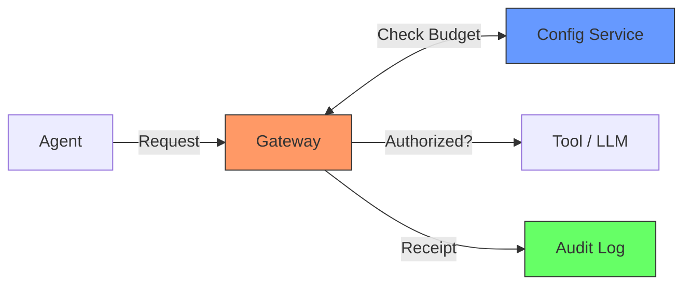
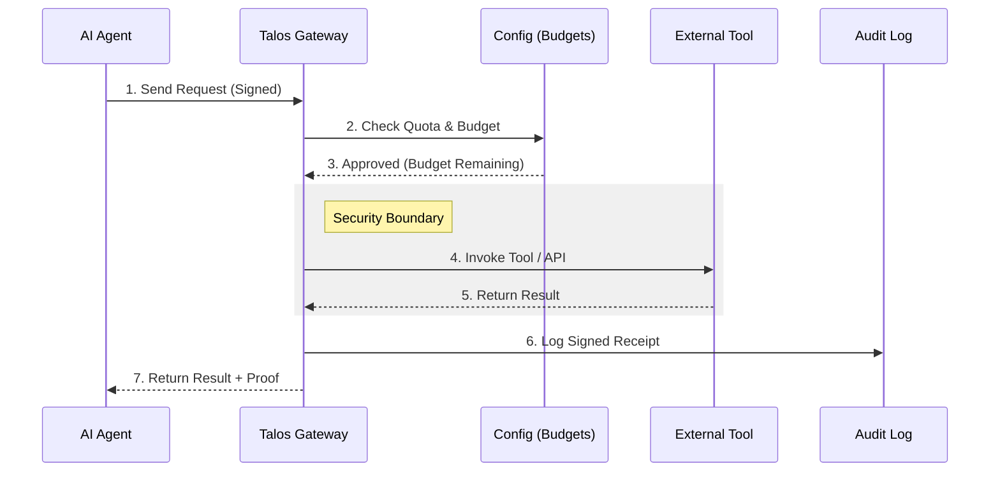

# Simplified Architecture

> **Talos v5.15** | **The "Secure Pipe" Concept**

---

## 🏗️ How it Works

Talos acts as a **Secure Pipe** between an AI Agent and the external world. No request can pass through without being verified against a budget and logged for audit.

---

## 📝 The Life of a Request

When an agent wants to perform an action (like calling a tool or sending a message):

---

## 🔑 Key Concepts for Humans

### 💰 Adaptive Budgets
Think of this as a **Smart Credit Card** for your AI. Every time the AI does something, Talos checks if it has enough "credits" and if the action follows the safety rules.

### 🛡️ The Gateway (The Guard)
The Gateway is like a **Security Checkpoint**. It checks the ID of the agent, verifies the signature of the message, and makes sure everything is encrypted.

### 📜 The Audit Log (The Black Box)
Like an airplane's black box, the Audit Log records everything. Because it uses **Merkle Chaining**, it is physically impossible to change a past log entry without everyone noticing.

### 🏗️ Contract-Driven
We use a **Master Blueprints** (Contracts) to make sure that the Python version, the JavaScript version, and the Rust version of Talos all speak exactly the same language.

---

> [!TIP]
> **Ready to try it?** Go to the [Quickstart](getting-started-quickstart) guide to see this flow in action!
