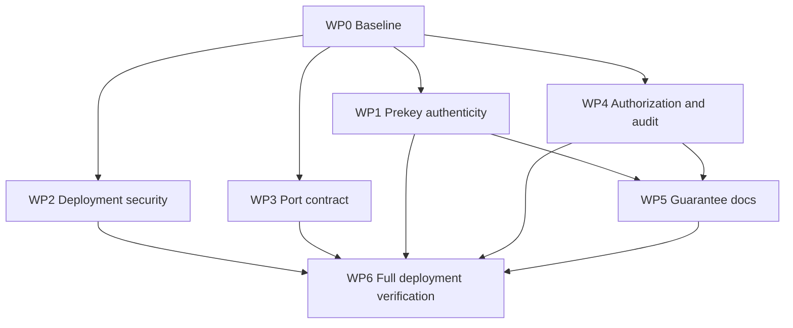

# Talos remediation implementation plan

**Created:** 2026-10-07
**Status:** In progress in the local working tree as of 2026-10-07. Changes are uncommitted and have not been deployed. The live handover and companion investigation are maintained in the workspace docs folder and are not part of this documentation repository.

## Goal

Close the verified Talos security, deployment, and documentation gaps without weakening contract boundaries or implying guarantees that are not tested. Deliver changes as reviewable work packages with their own test evidence. Production readiness remains unclaimed until the full deployment acceptance gates pass.

## Execution principles

- Preserve the existing dirty state in the root and submodules. Before each work package, record `git status --short` for affected paths and avoid resetting, cleaning, or replacing unrelated changes.
- Make the contract decision before changing signed bytes or authz behavior. `contracts/` owns schemas and shared vectors; consumers should use published artifacts rather than deep imports.
- Keep cross-submodule changes reviewable. Each submodule change needs its own commit/PR and the root pointer update should follow only after that change is available and validated. Do not commit existing unrelated edits as part of the fix.
- Prefer tests that fail against the current defect, then implement the smallest fix that makes them pass. Security paths need negative tests and durable audit evidence.
- Keep rollout reversible. Production config changes should have an explicit local-development profile and documented rollback variables/manifests.

## Work packages and order

### WP0 — Establish a clean evidence baseline

**Purpose:** Make later results attributable to the fixes rather than inherited local modifications.

**Actions:**

1. Capture root and affected submodule SHAs plus `git status --short` without modifying them.
2. Run the focused baseline for `core`, contract vector validation, gateway auth/audit tests, Compose/Kubernetes render checks, and dashboard status tests.
3. Save command output and classify failures as preexisting, environment-dependent, or introduced by a work package.
4. Recheck current deployment overlays and service ownership before selecting port numbers; do not infer a canonical port from a single launcher.

**Done when:** Baseline evidence is recorded, worktree changes are inventoried, and every planned test command is runnable or has a documented environment prerequisite.

### WP1 — Repair Rust signed-prekey authenticity

**Priority:** P0; blocks production use of the affected core path.
**Repositories:** `contracts`, `core`, then Rust SDK/conformance consumers if required.

**Sequence:**

1. Read the canonical prekey schema, protocol specification, current vector generator, and every consumer. Resolve the precise signing input and algorithm from the existing contract; do not create a new encoding implicitly.
2. Add/update contract-owned deterministic vectors for a valid bundle and invalid cases (wrong identity key, changed prekey, absent signature, malformed signature). Preserve JCS only if the contract calls for JSON canonicalization; the current Python implementation signs the raw signed-prekey bytes, so explicitly settle parity against that behavior.
3. Replace the all-zero signature in `core/src/domain/ratchet.rs` with identity-key signing. Change `set_signed_prekey` to verify or reject its supplied signature rather than discard `_sig` and later emit zeros. Make invalid setup fail closed.
4. Ensure the receive/session path verifies the peer bundle before DH/session state is accepted. If core lacks that API, add the smallest explicit verification boundary rather than relying on length checks.
5. Run Rust unit and conformance tests, then run the same shared vectors through Python, TypeScript, Go, Java, and Rust runners. Update protocol docs/examples only after these checks pass.

**Acceptance:** No public production bundle path can emit a placeholder signature; valid cross-SDK vectors pass; tampered, missing, and mismatched signatures are rejected before session establishment; secret key bytes never appear in logs or generated artifacts.

**Rollback:** Keep the old path disabled or marked test-only if the contract signing semantics cannot be established safely. Do not restore a zero-signature fallback.

### WP2 — Make deployment modes and secrets explicit

**Priority:** P0 before any reachable production deployment.
**Repositories:** root Compose/configuration; dashboard only if server-side validation belongs there; deployment examples/docs.

**Sequence:**

1. Inventory server-side auth and mode switches across Compose, `.env.example`, Dockerfiles, Kubernetes secrets/config maps, dashboard auth setup, and deployment scripts.
2. Define two supported modes: an explicit local development profile and a production profile. Production must not inherit `DEV_MODE=true`, disabled authentication, or fallback secrets.
3. Remove known development secret defaults from production paths. Require sufficiently strong secrets through required environment variables or secret mounts; fail at startup with a clear variable name, never its value.
4. Validate mode agreement between server variables and `NEXT_PUBLIC_*` build/runtime settings. Public flags must not be treated as security controls.
5. Add tests for missing secrets, known placeholder values, auth disabled, mismatched mode flags, and the valid local-dev profile. Verify configuration failure occurs before the service accepts requests.
6. Update `.env.example`, deployment instructions, and the runbook with safe local setup and production secret provisioning.

**Acceptance:** Production configuration fails closed for absent/placeholder secrets and disabled auth; local development remains usable through an explicit profile; no secret value is logged; dashboard auth tests and deployment configuration tests pass.

**Rollback:** Restore the prior profile only for isolated local development. Do not roll back by reintroducing public production fallbacks; production deploys remain blocked until safe configuration is available.

### WP3 — Establish one service and port contract

**Priority:** P1; prerequisite for reliable complete-stack smoke tests.
**Repositories:** root deployment files, dashboard, gateway/audit service deployment manifests, README and operator docs.

**Sequence:**

1. Build a source-backed inventory of each service's actual bind port, container port, published host port, health/readiness path, and dashboard URL across Compose, `deploy/scripts/common.sh`, `start_all.sh`, Kubernetes Services/Deployments/Ingress, and docs.
2. Resolve the intended public gateway entry (regional gateway vs AI gateway vs Envoy ingress) and audit endpoint with service owners. Record the decision in one canonical manifest/table.
3. Update Compose and shell launchers so service identity and health path match that mapping. Avoid moving a port just to make a readiness check pass.
4. Align Kubernetes service ports, dashboard environment URLs, local `.env.example`, README, development guide, and runbook.
5. Add an automated consistency check that reads the canonical map and rejects stale mappings; add a smoke test that requests distinct service-identity/health responses at the selected endpoints.

**Acceptance:** All supported launch paths resolve gateway and audit URLs to the intended services; Compose config and Kubernetes render pass; consistency check detects a deliberate mismatch; an integration smoke passes against the selected profile.

**Rollback:** Revert the mapping update as one deployment change if consumers cannot migrate together. Keep old and new endpoints documented only during a time-bounded migration window.

### WP4 — Prove gateway authorization and audit behavior

**Priority:** P1 security gate.
**Repositories:** `services/ai-gateway`, possibly `services/audit`, contracts only if event shape changes.

**Sequence:**

1. Trace each protected route from authentication extraction through identity/session checks, policy resolution, revocation/expiry/replay checks, and audit persistence. Identify whether `RBACMiddleware` is obsolete or intended to be active; do not wire it blindly alongside dependency-based auth.
2. Choose one canonical enforcement path and remove ambiguity. Eliminate fixed denial request IDs and mock-only logging.
3. Confirm request IDs are generated once, propagated to responses and audit events, and cannot be spoofed into audit identity fields.
4. Exercise allow and deny routes against the real policy engine and audit sink. Include no credentials, malformed/expired/replayed credentials, wrong principal/resource, over-scoped grants, missing runtime state, audit-sink failure, and successful authorization.
5. Ensure policy denial and security-relevant failures are durably auditable. Define fail-open/fail-closed behavior for audit sink outage from the existing normative contract; do not invent it in implementation.
6. Add route inventory coverage so newly added protected routes cannot bypass the chosen enforcement path.

**Acceptance:** Every protected route is covered; denied and allowed decisions have real request IDs and durable records; negative authz cases reject; audit sink outage follows the documented policy; no mock branch is counted as security evidence.

**Rollback:** Revert enforcement wiring only if the prior active auth path remains proven and the affected routes are not exposed. Do not re-enable an unverified bypass to restore availability.

### WP5 — Align system and product claims with shipped evidence

**Priority:** P1; can begin after WP1/WP4 facts are stable.
**Repositories:** root docs, docs submodule, SDK guides/examples, dashboard and marketing only where they state affected guarantees.

**Sequence:**

1. Create a guarantee matrix for confidentiality, authenticity, forward secrecy, post-compromise security, replay resistance, capability control, audit immutability/anchoring, and censorship resistance.
2. For each, link the exact contract, implementation, shared vector, integration test, deployment requirement, and residual limitation.
3. Mark unsupported or partially supported claims accurately. In particular, distinguish Merkle integrity from external blockchain anchoring, and routed discovery from direct P2P/NAT traversal.
4. Update `docs/architecture/protocol-guarantees.md`, threat model, relevant SDK guides, examples, runbooks, and product claims as needed. Keep one status source and link to it from secondary pages.
5. Run broken-link, context-graph, contract-drift, and docs checks.

**Acceptance:** Every “implemented” guarantee has current evidence links; unsupported claims are marked partial/planned; examples match tested behavior; no docs describe unverified security properties as present.

**Rollback:** Revert documentation only when evidence demonstrates the prior statement was correct; otherwise retain the conservative wording.

### WP6 — Full deployment verification and release gate

**Priority:** Final gate; dependent on WP1–WP4 and the chosen production profile.

**Actions:**

1. Start the complete supported profile in an isolated environment with generated test secrets and persistent volumes.
2. Run migrations, readiness checks, health checks, auth allow/deny flows, audit persistence checks, SDK interoperability vectors, and dashboard service aggregation.
3. Validate shutdown/restart and data persistence; capture logs with secrets redacted.
4. Run `docker compose config`, Kubernetes render/schema checks, boundary/drift checks, the changed component suite, and the full 13-component CI discovery suite.
5. Produce a release evidence bundle listing commit/submodule SHAs, configuration mode (no secret values), test results, health endpoints, and unresolved gaps.

**Acceptance:** All required services are healthy in the production profile with no local-only overrides; all prior package gates pass; no unresolved P0/P1 finding remains; residual risks have named owners and explicit status.

**Rollback:** Roll back the deployment artifact and configuration together to the last known-good release. Preserve database backups and migration compatibility; do not roll back schema changes without a tested down/forward-recovery path.

## Dependency order



WP1, WP2, and WP3 can be developed as separate work packages after WP0. WP4 should remain serial within the gateway/auth/audit path. WP5 should not finalize claims until WP1 and WP4 behavior is settled. WP6 is the final integrated gate.

## Cross-cutting verification commands

Run the narrow owner-repository tests first, then the following root gates after each cross-boundary merge:

```bash
bash deploy/scripts/check_boundaries.sh
python3 scripts/verify_agent_layout.py
python3 scripts/agent_sync.py
python3 scripts/python/check_contract_drift.py
python3 scripts/python/generate_context_graph.py --check
uv run --with pyyaml --no-project python deploy/scripts/run_all_tests.py --ci
docker compose config -q
git diff --check
```

The exact focused test commands should be recorded in each work package once repository owners confirm current manifests and test entrypoints. Never use a green root suite as a substitute for the signed-prekey vector, route-level authorization, or full deployment checks.

## Tracking table

| Package | State | Dependency | Target output |
|---|---|---|---|
| WP0 Baseline | Complete | None | Existing dirty state inventoried; changes preserved |
| WP1 Prekey authenticity | Implemented locally; Rust tests pass | WP0 | Rust signing/verification and positive/negative tests; SDK-wide parity remains open |
| WP2 Deployment security | Partially implemented; Compose rendering passes | WP0 | Production, staging, and remote profiles require auth/secrets; broader inherited-service hardening and runtime startup checks remain open |
| WP3 Port contract | Port map and static gate implemented | WP0 | Compose, launchers, audit service, dashboard URLs, Kubernetes references aligned; service identity smoke test remains open |
| WP4 Authorization and audit | Partially implemented; focused test passes | WP0 | Scope denials carry request IDs and audit as denied; durable persistence, sink outage policy, and full route coverage remain open |
| WP5 Guarantee documentation | Partially updated | WP1, WP4 | README and protocol guarantees claims narrowed; full guarantee-to-evidence matrix remains open |
| WP6 Full deployment gate | Not run | WP1–WP5 | No full stack, Kubernetes cluster, or release evidence bundle |
