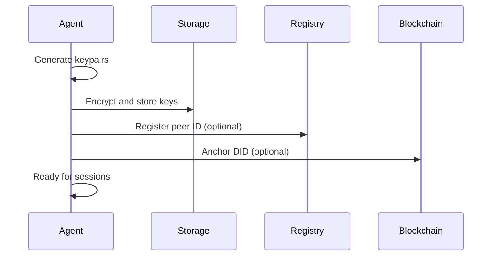
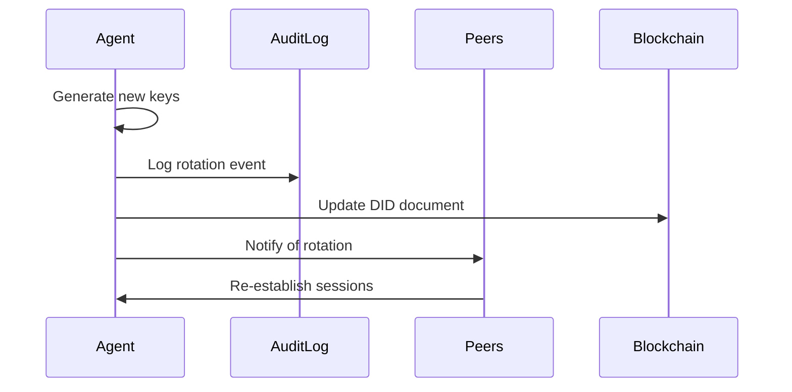

# Agent Lifecycle

> **Problem**: Agents have complex lifecycles beyond creation.  
> **Guarantee**: Clear guidance for provisioning, rotation, recovery, revocation.  
> **Non-goal**: Implementation code—see [Python SDK](Python-SDK).

---

## Lifecycle Overview

```
┌─────────────┐     ┌─────────────┐     ┌─────────────┐
│ Provisioning│────▶│   Active    │────▶│  Rotation   │
└─────────────┘     └──────┬──────┘     └──────┬──────┘
                          │                    │
                          ▼                    ▼
                   ┌─────────────┐     ┌─────────────┐
                   │   Recovery  │◀────│   Active    │
                   └──────┬──────┘     └─────────────┘
                          │
                          ▼
                   ┌─────────────┐
                   │  Revocation │
                   └─────────────┘
```

---

## 1. Provisioning

Creating a new agent identity.

### Minimal Provisioning

```python
from talos import TalosClient

# Create with auto-generated keys
client = await TalosClient.create("my-agent")
print(f"Peer ID: {client.peer_id}")
print(f"Public Key: {client.public_key.hex()}")
```

### With Persistent Storage

```python
# Keys are stored for later recovery
client = await TalosClient.create(
    "my-agent",
    data_dir="/secure/path/agent_data",
    password="strong-passphrase"  # Encrypts key storage
)
```

### With DID Anchoring

```python
# Optionally anchor identity on-chain
client = await TalosClient.create(
    "my-agent",
    anchor_identity=True,
    chain="optimism"
)
print(f"DID: {client.did}")  # did:talos:7f3k2m...
```

### What's Created

| Artifact | Purpose | Storage |
|----------|---------|---------|
| Identity keypair (Ed25519) | Signing | Encrypted file |
| Encryption keypair (X25519) | Key exchange | Encrypted file |
| Prekey bundle | Session establishment | Shareable |
| DID document | Public identity (optional) | On-chain |

---

## 2. Active Operation

Agent is running and communicating.

### State Maintained

| State | Persistence | Recovery |
|-------|-------------|----------|
| Identity keys | Permanent | From storage |
| Session states | Memory | Re-establish |
| Audit log | Permanent | From storage |
| Capabilities | Until expiry | Re-grant |

### Normal Operations

- Establish/terminate sessions
- Send/receive messages
- Grant/use capabilities
- Commit to audit log

---

## 3. Key Rotation

Periodic or emergency key updates.

### Scheduled Rotation

```python
# Rotate encryption prekeys (recommended: weekly)
await client.rotate_prekeys()

# Rotate identity key (rare, requires migration)
new_identity = await client.rotate_identity(
    migration_period=timedelta(days=7)
)
```

### Emergency Rotation

```python
# If compromised, rotate immediately
await client.emergency_rotate(
    reason="potential key exposure",
    revoke_old=True
)
```

### What Happens on Rotation

1. New keys generated
2. Old keys revoked (logged to audit)
3. DID document updated (if anchored)
4. Peers notified
5. Sessions re-established with new keys

### Rotation Audit Entry

```json
{
  "type": "KEY_ROTATE",
  "timestamp": "2024-01-15T10:00:00Z",
  "old_key_hash": "0x1a2b3c4d...",
  "new_key_hash": "0x5e6f7g8h...",
  "reason": "scheduled rotation",
  "signature": "0x..."
}
```

---

## 4. Recovery

Restoring agent from backup or after failure.

### From Backup

```python
# Recover from encrypted backup
client = await TalosClient.recover(
    backup_path="/backup/agent_data.enc",
    password="strong-passphrase"
)
```

### State Recovery

| State | Recovery Method |
|-------|-----------------|
| Identity keys | From encrypted backup |
| Audit log | From local storage |
| Sessions | Re-establish (stateless) |
| Capabilities | Re-grant or renew |
| Peers | Re-discover via DHT |

### Partial Recovery

If only identity keys are recovered:

```python
client = await TalosClient.recover_identity_only(
    private_key=recovered_key,
    rebuild_audit=True  # Sync from peers
)
```

---

## 5. Revocation

Permanently disabling an agent.

### Self-Revocation

```python
# Agent revokes itself (e.g., decommissioning)
await client.revoke_identity(reason="agent decommissioned")
```

### External Revocation

```python
# Org admin revokes a compromised agent
await admin_client.revoke_identity(
    did="did:talos:compromised_agent",
    reason="security incident",
    evidence="incident_report_hash"
)
```

### Revocation Effects

1. Identity marked as revoked
2. All capabilities invalidated
3. Revocation anchored on-chain
4. Peers notified
5. No further messages accepted

### Revocation Audit Entry

```json
{
  "type": "REVOCATION",
  "timestamp": "2024-01-15T12:00:00Z",
  "did": "did:talos:7f3k2m...",
  "reason": "security incident",
  "evidence": "0xabc123...",
  "revoker": "did:talos:admin",
  "signature": "0x..."
}
```

---

## Failure Modes

### Lost Keys

**Situation**: Private key backup is lost or corrupted.

**Impact**:
- Cannot recover identity
- Cannot prove past actions
- Sessions cannot be resumed

**Prevention**:
- Multiple encrypted backups
- Consider HSM/TPM storage
- Key ceremony for critical agents

**Recovery**:
- Create new identity
- Re-establish trust with peers
- Old identity remains valid until revoked

---

### Corrupt State

**Situation**: Local storage is corrupted.

**Impact**:
- Session state lost
- Audit log may be incomplete
- Capability cache lost

**Recovery**:
```python
# Rebuild from minimal state
client = await TalosClient.recover_identity_only(
    private_key=recovered_key,
    sync_from_peers=True
)
```

---

### Split Brain

**Situation**: Agent runs on multiple hosts simultaneously.

**Impact**:
- Session state diverges
- Audit logs diverge
- Peers receive conflicting messages

**Prevention**:
- Single-instance enforcement
- Lease-based locking
- Hardware-bound keys

**Recovery**:
- Stop all instances
- Reconcile state
- Rotate keys (security precaution)
- Resume single instance

---

### Network Partition

**Situation**: Agent cannot reach peers or registry.

**Impact**:
- Messages queued, not delivered
- Capability checks may use stale revocation list
- DID resolution fails

**Behavior**:
- Default: fail closed (deny if uncertain)
- Optional: grace period for cached capabilities

**Recovery**:
- Automatic when connectivity restored
- Queued messages delivered
- Revocation list synced

---

## Multi-Device / Cloning

### Legitimate Cloning

Some use cases require agent replicas:

```python
# Create a replica with shared identity
replica = await client.create_replica(
    replica_id="replica-2",
    sync_mode="leader-follower"
)
```

### Sync Modes

| Mode | Behavior |
|------|----------|
| `leader-follower` | One active, others passive |
| `active-active` | All can act, state synchronized |
| `read-only` | Replica can receive, not send |

### Cloning Risks

- State divergence
- Double-spending capabilities
- Audit log conflicts

**Mitigation**: Use leader election or hardware-bound keys.

---

## Sequence Diagrams

### Provisioning Flow



### Key Rotation Flow



---

## CLI Commands

```bash
# Show agent identity
talos whoami

# Rotate prekeys
talos rotate prekeys

# Rotate identity (with migration period)
talos rotate identity --migration-days 7

# Revoke agent
talos revoke --reason "decommissioned"

# Recover from backup
talos recover --backup /path/to/backup.enc
```

---

**See also**: [Agent Capabilities](Agent-Capabilities) | [Key Management](Key-Management) | [Hardening Guide](Hardening-Guide)
