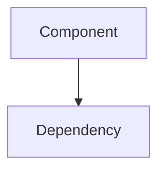

# [Title]

**Repo Role**: [One-line role description]

## Abstract
[Academic summary of the component's purpose and contribution]

## Introduction
[Problem classification and specific Solution provided by this component]

## System Architecture



[Description of how this component fits into the 12-repo topology]

## Technical Design
### Modules
- **Module A**: Description
- **Module B**: Description

### Data Formats
- Contracts used: `[Contract Name]`
- Wire formats: `[Format]`

## Evaluation
> Choose one:
> * [Metrics / Benchmark table]
> * "Evaluation: N/A for this repo (See: [Link to repo with output])"

## Usage
### Quickstart
```bash
# Command to run
```

### Common Workflows
1.  **Workflow A**: Description
2.  **Workflow B**: Description

## Operational Interface
*   `make test`: Run unit tests
*   `make typecheck`: Run static analysis (if applicable)
*   `make conformance`: Run vector conformance (if applicable)
*   `scripts/test.sh`: CI entrypoint script

## Security Considerations
*   **Threat Model**: [Summary]
*   **Guarantees**: [List of guarantees]

## References
1.  [Internal Spec link]
2.  [External Paper]
