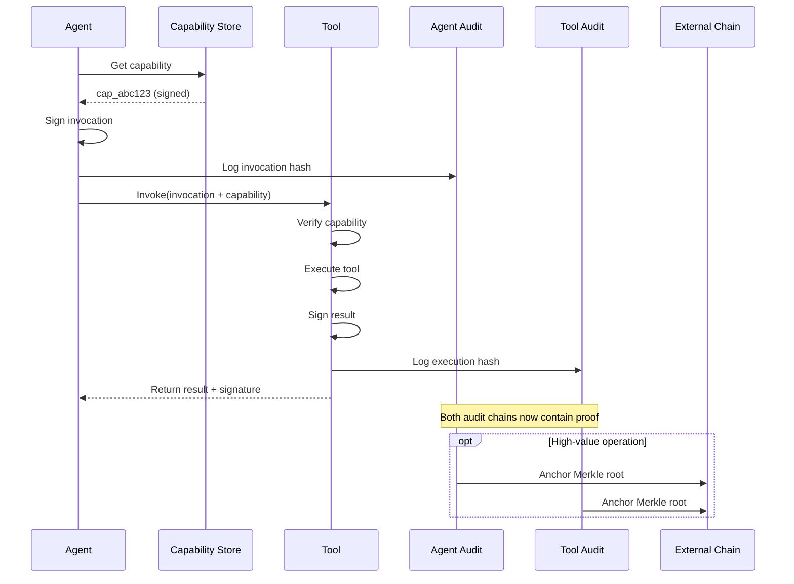

# MCP Tool Invocation Proofs

> **Status**: Partial (v3.0.0) | **Code**: `src/core/proofs.py` (planned) | **Version**: 2.0.6+

> **The Complete Flow from Agent Action to Verifiable Evidence**

This page stitches together [Agent Capabilities](Agent-Capabilities), [MCP Integration](MCP-Integration), and [Audit Explorer](Audit-Explorer) into one end-to-end proof flow.

---

## The Four-Layer Artifact Model

Every MCP tool invocation produces four layers of cryptographic evidence:

```
┌─────────────────────────────────────────────────────────────┐
│ 1. IDENTITY     │ DID + Public Key Anchor                   │
├─────────────────────────────────────────────────────────────┤
│ 2. AUTHORITY    │ Capability Token (scope + constraints)    │
├─────────────────────────────────────────────────────────────┤
│ 3. INTENT       │ Agent's Signed Request (what it asked)    │
├─────────────────────────────────────────────────────────────┤
│ 4. EXECUTION    │ Tool's Signed Result (what happened)      │
└─────────────────────────────────────────────────────────────┘
```

---

## What Gets Signed

### 1. Agent Signs the Invocation

```python
invocation = {
    "id": "inv_7f3k2m",
    "timestamp": "2024-12-24T08:00:00Z",
    "agent_id": "did:talos:agent123",
    "tool": "filesystem/read",
    "params": {"path": "/data/report.csv"},
    "capability_ref": "cap_abc123",
}
signature = agent_private_key.sign(canonical(invocation))
```

**What this proves**: The agent with DID `did:talos:agent123` requested this specific action at this time.

### 2. Capability Is Attached

```python
capability = {
    "id": "cap_abc123",
    "issuer": "did:talos:owner",
    "subject": "did:talos:agent123",
    "scope": "filesystem/read",
    "constraints": {"paths": ["/data/*"]},
    "expires_at": "2024-12-24T12:00:00Z",
    "signature": "...",  # Issuer's signature
}
```

**What this proves**: The agent was authorized by the owner to perform this action.

### 3. Tool Signs the Result

```python
execution = {
    "id": "exec_9d4m3n",
    "invocation_ref": "inv_7f3k2m",
    "timestamp": "2024-12-24T08:00:01Z",
    "result_hash": sha256(result_bytes),
    "status": "success",
}
signature = tool_private_key.sign(canonical(execution))
```

**What this proves**: The tool received the request and produced this result.

---

## What Gets Logged

Each invocation creates an audit entry on both ends:

### On Agent's Node

```json
{
  "type": "tool_invocation",
  "invocation_id": "inv_7f3k2m",
  "invocation_hash": "0x1234...",
  "capability_id": "cap_abc123",
  "tool": "filesystem/read",
  "params_hash": "0xabcd...",
  "block_height": 42,
  "merkle_proof": "..."
}
```

### On Tool's Node

```json
{
  "type": "tool_execution",
  "invocation_ref": "inv_7f3k2m",
  "execution_id": "exec_9d4m3n",
  "result_hash": "0x5678...",
  "status": "success",
  "block_height": 108
}
```

---

## What Gets Anchored (Optional)

For high-value operations, Merkle roots can be anchored to external chains:

| Chain | Method | Cost | Latency |
|-------|--------|------|---------|
| Ethereum L2 | Batch root in calldata | ~$0.10/batch | ~2 min |
| Solana | Memo instruction | ~$0.0001 | ~400ms |
| Bitcoin | Taproot commitment | ~$0.50/batch | ~10 min |

```bash
# Anchor current audit state
talos anchor --chain ethereum --batch-size 1000
```

---

## How an Auditor Verifies

### Step 1: Get the Proof

```bash
talos proof show inv_7f3k2m
```

Output:

```yaml
Invocation: inv_7f3k2m
  Agent: did:talos:agent123
  Tool: filesystem/read
  Params: {path: /data/report.csv}
  Timestamp: 2024-12-24T08:00:00Z
  
Authority:
  Capability: cap_abc123
  Issuer: did:talos:owner
  Scope: filesystem/read
  Valid: Yes (expires in 4h)
  
Execution:
  Result Hash: 0x5678...
  Status: success
  Tool Signature: VALID
  
Audit State:
  Agent Block: 42 (merkle verified)
  Tool Block: 108 (merkle verified)
  Anchor: Ethereum 0xabc... (confirmed)
```

### Step 2: Verify Cryptographic Chain

```bash
talos proof verify inv_7f3k2m
```

Verification steps:

1. ✅ Agent signature valid on invocation
2. ✅ Capability signature valid from issuer
3. ✅ Capability covers requested scope
4. ✅ Capability not expired at invocation time
5. ✅ Capability not revoked
6. ✅ Tool signature valid on execution
7. ✅ Invocation logged in agent's audit chain
8. ✅ Execution logged in tool's audit chain
9. ✅ (If anchored) Merkle root in external chain

### Step 3: Export for External Audit

```bash
talos proof export inv_7f3k2m --format json > proof.json
```

The exported proof is self-contained and can be verified offline:

```bash
talos proof verify --file proof.json --offline
```

---

## Proof Flow Diagram



---

## SDK Usage

```python
from talos import TalosClient

async with TalosClient.create("auditor") as client:
    # Get proof for an invocation
    proof = await client.get_proof("inv_7f3k2m")
    
    # Verify all layers
    result = await client.verify_proof(proof)
    
    if result.valid:
        print(f"✅ Proof valid")
        print(f"   Agent: {result.agent_id}")
        print(f"   Tool: {result.tool}")
        print(f"   Authority: {result.capability_id}")
        print(f"   Anchored: {result.anchor_tx or 'No'}")
    else:
        print(f"❌ Verification failed: {result.errors}")
```

---

## Why This Matters

### For Enterprise Buyers

> "Can you prove what your agent did last Tuesday?"

Yes. Every tool invocation has cryptographic evidence that can be verified months later, even if all parties are offline.

### For Compliance Teams

> "Who authorized this action?"

The capability chain shows exactly which identity delegated which permissions, with timestamps and constraintsr.

### For Incident Response

> "What sequence of events led to this outcome?"

The audit chain provides a tamper-evident log that can be reconstructed and verified independently.

---

## See Also

- [Agent Capabilities](Agent-Capabilities) - Authorization model
- [Audit Explorer](Audit-Explorer) - CLI commands for querying
- [MCP Integration](MCP-Integration) - Transport architecture
- [Security Properties](Security-Properties) - Formal guarantees
