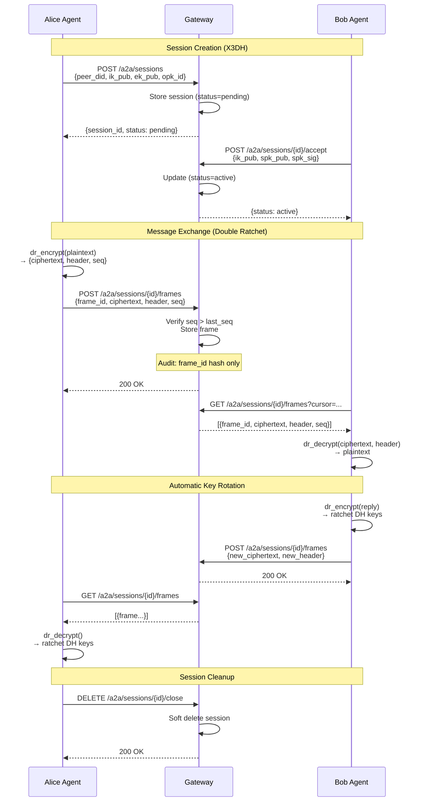

# A2A Channels

> **Phase 10 Feature** | Phase 10.1 Released 2026-01-29, Phase 10.2 Completed 2026-01-29

A2A (Agent-to-Agent) Channels provide secure, encrypted communication between Talos agents with forward secrecy, replay protection, and hash-chained audit trails.

## Overview

A2A Channels use the Double Ratchet algorithm (Signal Protocol) to provide:

- **Forward Secrecy**: Per-message keys that are deleted after use
- **Break-in Recovery**: Automatic key rotation with each message exchange
- **Replay Protection**: Monotonic sequence numbers with database UNIQUE constraints
- **Content Privacy**: Audit logs contain only metadata and digests, never plaintext

## Session Lifecycle

## Messaging Flow Diagram



## Key Components

### Gateway Surfaces

| Endpoint                      | Method | Description                   |
| :---------------------------- | :----- | :---------------------------- |
| `/a2a/sessions`               | POST   | Create new session            |
| `/a2a/sessions/{id}/accept`   | POST   | Accept pending session        |
| `/a2a/sessions/{id}/frames`   | POST   | Send encrypted frame          |
| `/a2a/sessions/{id}/frames`   | GET    | Receive frames (cursor-based) |
| `/a2a/sessions/{id}/close`    | DELETE | Close session                 |
| `/a2a/sessions/{id}/rotate`   | POST   | Rotate session keys           |
| `/a2a/groups`                 | POST   | Create group                  |
| `/a2a/groups/{id}/members`    | POST   | Add group member              |
| `/a2a/groups/{id}/members/{pid}` | DELETE | Remove group member        |
| `/a2a/groups/{id}`            | DELETE | Close group                   |

### SDK Components

```python
from talos_sdk.a2a import A2ASessionClient, A2ATransport
from talos_sdk.a2a.ratchet_crypto import RatchetFrameCrypto
from talos_sdk.session import Session, SessionManager

# Create wallets
alice_wallet = Wallet.generate()
bob_wallet = Wallet.generate()

# Create session manager
alice_mgr = SessionManager(alice_wallet.keypair)
bob_mgr = SessionManager(bob_wallet.keypair)

# X3DH key exchange
bob_bundle = bob_mgr.get_prekey_bundle()
alice_session = alice_mgr.create_session_as_initiator("bob", bob_bundle)
bob_session = bob_mgr.create_session_as_responder("alice", alice_session.state.dh_keypair.public_key)

# Create crypto adapters
alice_crypto = RatchetFrameCrypto(alice_session)
bob_crypto = RatchetFrameCrypto(bob_session)

# Encrypt and send
plaintext = b"Hello Bob!"
header, ciphertext, ct_hash = alice_crypto.encrypt(plaintext)

# Decrypt
decrypted = bob_crypto.decrypt(header, ciphertext, ct_hash)
assert decrypted == plaintext
```

## Security Properties

| Property               | Implementation                              |
| :--------------------- | :------------------------------------------ |
| **Forward Secrecy**    | Double Ratchet per-message keys             |
| **Replay Protection**  | `UNIQUE(session_id, sender_id, sender_seq)` |
| **Integrity**          | `frame_digest = SHA256(canonical_preimage)` |
| **Ciphertext Binding** | `ciphertext_hash = SHA256(ciphertext)`      |
| **Single-Writer**      | `pg_try_advisory_xact_lock`                 |
| **Audit Privacy**      | Only digests in logs, never plaintext       |

## Benchmarks

| Operation                  | Throughput        |
| :------------------------- | :---------------- |
| Session.encrypt(35B)       | 50,729 ops/sec    |
| Session.encrypt(10KB)      | 17,456 ops/sec    |
| Session roundtrip          | 669 ops/sec       |
| RatchetFrameCrypto.encrypt | 36,619 ops/sec    |
| Canonical JSON + SHA256    | 2,616,860 ops/sec |

## Group Messaging

A2A also supports multi-party group sessions:

```python
# Create group
group_id = await client.create_group("security-ops")

# Add member
await client.add_member(group_id, "alice-did")

# Group events are hash-chained
# Each event links to previous via prev_digest
```

### Group Event Types

- `INVITED` - Member invited to group
- `JOINED` - Member accepted invitation
- `REMOVED` - Member removed from group
- `CLOSED` - Group closed by owner

## Related Pages

- [Double Ratchet](double-ratchet.md) - Underlying encryption protocol
- [Python SDK](../../sdk/python-sdk.md) - SDK documentation
- [Benchmarks](../../testing/benchmarks.md) - Full performance data
- [Architecture](../../architecture/overview.md) - System design
