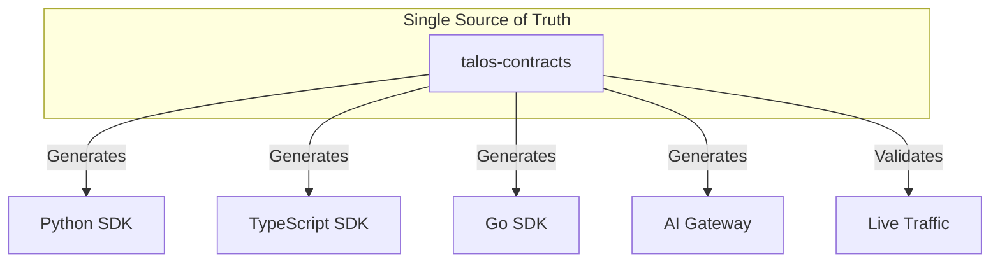
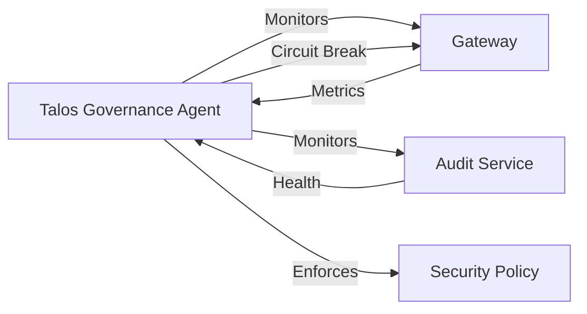
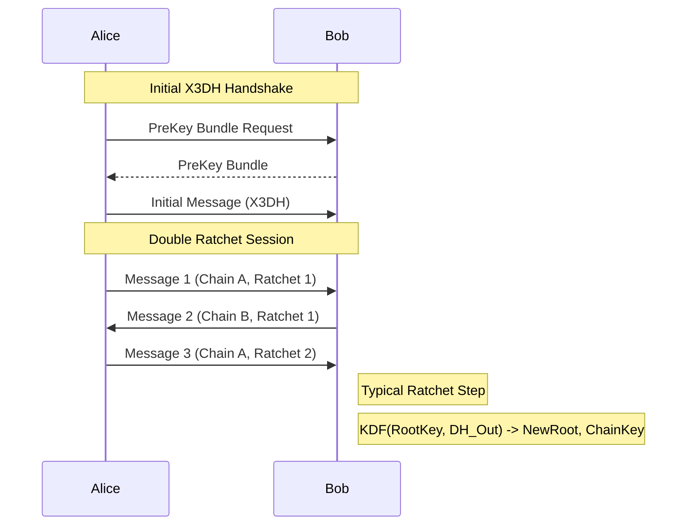
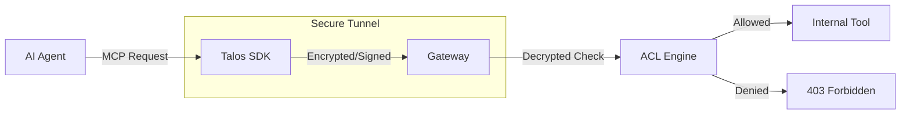
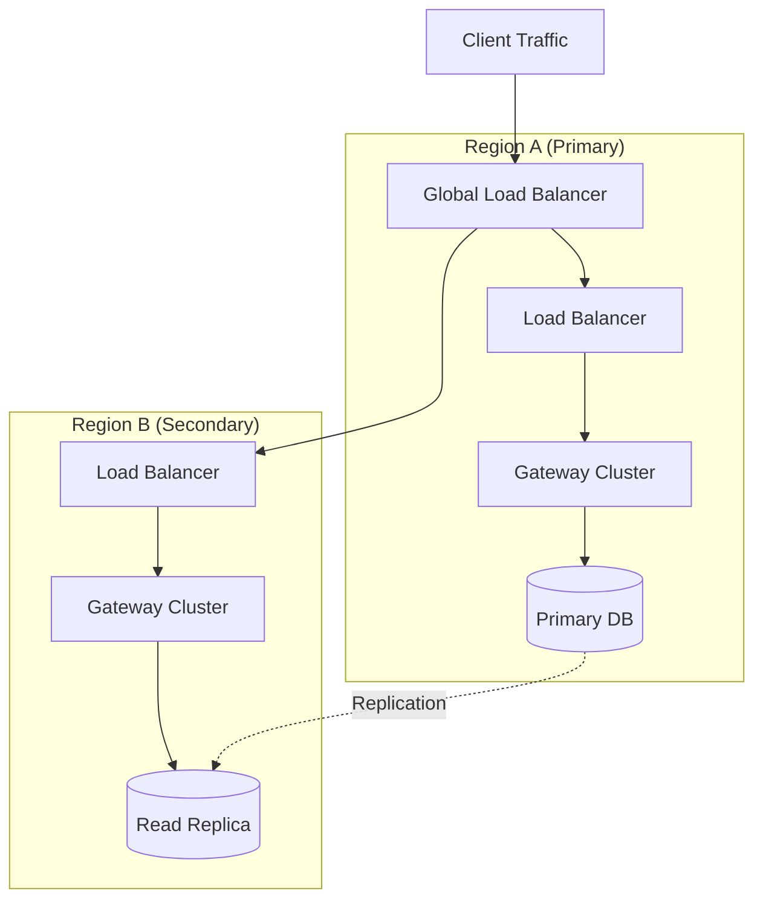

# Talos Protocol Whitepaper

## Secure, Decentralized Communication for the Autonomous AI Agent Era

**Version**: 4.1.0  
**Date**: January 2026  
**Status**: Stable / Production-Grade  
**Authors**: Talos Protocol Contributors

---

## Abstract

As autonomous AI agents transition from simple chatbots to complex entities capable of execution and negotiation, the absence of a trustable communication substrate has become a critical bottleneck. Existing transport layers (HTTP/WebSockets) and centralized authorization frameworks (OAuth) are insufficient for the "agent-to-agent" world, where human-in-the-loop verification is impractical.

The Talos Protocol addresses this by providing a cryptographically secure, decentralized, and contract-driven messaging layer. By integrating the Signal Double Ratchet algorithm for forward secrecy, self-sovereign identities (DIDs), and a blockchain-anchored audit trail, Talos establishes a "Security Tunnel" for the Model Context Protocol (MCP). This whitepaper outlines the technical architecture, security proofs, and implementation strategies that make Talos the missing trust layer for the agentic future.

---

## 1. Introduction: The Agent Trust Gap

The rise of Large Language Models (LLMs) has birthed a new class of digital citizens: **Autonomous Agents**. These agents perform tasks, invoke tools, and negotiate on behalf of humans. However, their proliferation is hampered by several fundamental security challenges:

- **Identity**: How can an agent prove who it is without a central registry?
- **Authorization**: How are permissions granted and verified in <1ms without hitting a central bottleneck?
- **Confidentiality**: How can agent-to-agent talk be protected such that even a compromised server cannot read past history?
- **Accountability**: How can we prove what an agent did (or was told to do) after the fact?

Talos Protocol bridge this gap by prioritizing **determinism** and **mathematical certainty** over centralized trust.

---

## 2. The Talos Solution

Talos is a multi-layered security framework designed to wrap existing agent interactions in a verified envelope. Its core philosophy is: **"Trust Math, Not Servers."**

The protocol is built on five pillars:

1. **Contract-Driven Determinism**: Centralized specifications for decentralized execution.
2. **Perfect Forward Secrecy**: Per-message key rotation.
3. **Self-Sovereign Identity**: Decentralized identifiers (DIDs) via DHT.
4. **Immutable Accountability**: Blockchain-anchored proofs of interaction.
5. **Runtime Resilience**: Automated governance and recovery via **Talos Governance Agent (TGA)**.

---

## 3. Core Architecture

### 3.1 Contract-Driven Kernel (`talos-contracts`)

In the Talos ecosystem, **Specification is King**. The `talos-contracts` repository is the single source of truth for all protocol definitions.

- **JSON Schemas**: strictly define every message type, preventing injection attacks.
- **Golden Vectors**: thousands of cryptographically generated test cases that every SDK (Python, TS, Go, Java) must pass.
- **Rules of Interop**: no implementation is allowed to "improvise" cryptographic derivations; they must adhere to the contract.

### 3.2 High-Performance Kernel (`talos-core-rs`)

To handle the high-throughput requirements of AI agents (sometimes thousands of tool calls per minute), Talos utilizes a Rust-based kernel.

- **The Rust Wedge**: Critical cryptographic primitives (Ed25519, ChaCha20-Poly1305) and Merkle Tree logic are implemented in Rust.
- **PyO3/Maturin Integration**: These high-performance bindings are exposed to Python and other high-level languages without overhead.

### 3.3 Talos Governance Agent (TGA)

The TGA serves as the immune system of the protocol, ensuring operational stability without manual intervention.

- **Runtime Resilience**: Automatically detects and mitigates failures in agent loops.
- **Drift Detection**: Validates that running services match their deployed configuration.
- **Self-Healing**: Triggers circuit breakers and safeguards during high-load events.

---

## 4. Security Model

### 4.1 Confidentiality via Double Ratchet

Talos implements the **Double Ratchet Algorithm** (pioneered by Signal).

- **Key Exchange**: Uses X3DH (Extended Triple Diffie-Hellman) for asynchronous initial handshakes.
- **Per-Message Rotation**: Every single message sent between agents uses a unique key.
- **Forward Secrecy**: If an agent's current session state is compromised, the attacker still cannot decrypt messages sent previously.

### 4.2 Authenticity and Identity

Every Talos agent is identified by an **Ed25519 Public Key**.

- **Self-Sovereign DIDs**: Agent identities are expressed as `did:talos:<pubkey>`.
- **Kademlia DHT**: Discovery of these identities happens via a peer-to-peer Distributed Hash Table, removing the need for a central "Agent Address Book."

### 4.3 Integrated Audit Trail

Unlike traditional message queues, Talos records message headers (sender, recipient, timestamp, hash) in a **Tamper-Evident Merkle Log**.

- **Cryptographic Chaining**: Every event is hashed and linked to the previous one, creating an unbreakable chain of custody.
- **Merkle Roots**: Event hashes are aggregated into Merkle trees, enabling efficient "SPV Proofs" where clients can verify inclusion without downloading the entire log.
- **Signed Commitments**: The root of the tree is signed by the Audit Service, providing a definitive anchor for the system's state.

---

## 5. MCP Integration: The Security Tunnel

The **Model Context Protocol (MCP)** is the industry standard for LLM-to-Tool communication. Talos acts as a "Secure Wrapper" for MCP.

### 5.1 Capability-Based Authorization

Talos introduces **Scoped Capability Tokens**. An agent doesn't just "have access"; it has a cryptographic token signed by its owner that grants `read` access to `repo/src/**` only for the next `30 minutes`. These are checked at the gateway in <1ms using cached cryptographic hits.

---

## 6. Enterprise-Grade Features (Phases 9-15)

Talos has evolved from a research prototype to a hardened production system:

### 6.1 Production Hardening (Phase 11)

- **Rate Limiting**: Token bucket algorithm backed by Redis prevents abuse.
- **Distributed Tracing**: Full OTLP integration for verifying request flows across service boundaries.
- **Health Checks**: Deep readiness probes ensure traffic only reaches healthy nodes.

### 6.2 Multi-Region Architecture (Phase 12)

- **Read/Write Splitting**: Optimizes database throughput by directing reads to local replicas.
- **Circuit Breakers**: Automatically fails over traffic to health-checked alternatives during partial outages.

### 6.3 Automated Operations (Phase 13, 15)

- **Secrets Rotation**: Zero-downtime rotation of cryptographic keys using multi-KEK envelopes.
- **Adaptive Budgets**: Atomic cost controls prevent agents from exceeding financial or compute quotas.

---

## 7. Performance and Scalability

Talos is built for enterprise-grade performance:

- **Throughput**: Supports >695,000 auth checks per second.
- **Latency**: p99 latency for secure tunneling is <5ms.
- **Light Client Mode**: Mobile or edge agents only need to store block headers (~99% storage reduction), using Merkle proofs to verify their specific messages.

---

## 8. Roadmap and Future Vision

### v4.1 (Current - "Argonaut")

- High-performance Rust kernel integration.
- Polyglot SDK parity (Python, TS, Go, Java).
- **AI Configuration Assistant**: Natural language configuration of security policies via Dashboard.
- **Talos Governance Agent (TGA)**: Automated runtime resilience.

### v5.0 (Upcoming)

- **Post-Quantum Hybrid Encryption**: Kyber-768 integration to protect today's agent communications against tomorrow's quantum computers.
- **Onion Routing**: Metadata protection to hide "who is talking to whom" from network observers.
- **ZK-Proofs**: Zero-Knowledge verification for private capability grants.
- **Global Load Balancing (Phase 14)**: Geo-routing and traffic optimization.

---

## 9. Conclusion

The Talos Protocol transforms the internet from a "network of servers" into a **"trust-minimized substrate for autonomous intelligence."** By moving security from the infrastructure layer to the message and contract layer, Talos enables a future where agents can co-operate across organizational boundaries with absolute cryptographic certainty.

**Trust Math. Enable Agents. Secure the Future.**

---

## References

1. _The Double Ratchet Algorithm_, Signal Messaging Inc.
2. _Model Context Protocol (MCP) Specification_, ModelContextProtocol.
3. _JSON Schema: A Media Type for Describing JSON Data Structures_, IETF.
4. _Decentralized Identifiers (DIDs) v1.0_, W3C.
