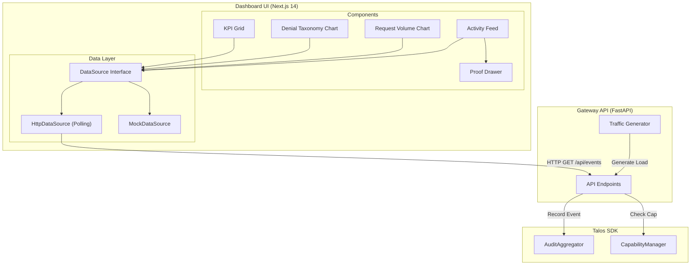

# Security Dashboard

> **Problem**: Operators need real-time visibility into security events and denial patterns.  
> **Guarantee**: Web-based console with live metrics, denial analytics, and proof verification.  
> **Non-goal**: Full SIEM replacement—see [Observability](../features/observability/observability.md) for integration.

---

## Quick Start

```bash
# Start the full development stack
./start.sh

# Dashboard: http://localhost:3000
# API: http://localhost:8000
```

---

## Authentication

Access to the dashboard is restricted to authenticated users via **WebAuthn (Passkeys)**.

- **Login Page**: `/login` (Automatically redirected)
- **Mechanism**: Passkey-based authentication (WebAuthn)
- **Initial Setup**: Admin access must be bootstrapped using a secret token.
- **Protected Routes**: `/`, `/console`, `/status`

### Bootstrap Process

For initial installation or adding a new admin device:
1. Obtain the `TALOS_BOOTSTRAP_TOKEN` from the environment configuration.
2. Navigate to `/login` and select **Setup Admin Access**.
3. Enter the bootstrap token and register your security key/biometric as the primary admin.

---

## Features (v3.2)

### Overview Page (`/`)

| Feature                   | Description                                                   |
| ------------------------- | ------------------------------------------------------------- |
| **KPI Grid**              | Total Requests (24h), Auth Success Rate, Denial Rate, Latency |
| **Denial Taxonomy Chart** | Pie chart showing breakdown by denial reason                  |
| **Request Volume Chart**  | Stacked area chart (OK/DENY/ERROR over 24h)                   |
| **Activity Feed**         | Live stream of audit events with cursor pagination            |
| **Status Banners**        | Mode indicator (LIVE API / DEMO TRAFFIC), Redaction policy    |

### Denial Reasons (v3.2 Frozen)

| Reason               | Description                                         |
| -------------------- | --------------------------------------------------- |
| `NO_CAPABILITY`      | No capability presented                             |
| `EXPIRED`            | Capability expired                                  |
| `REVOKED`            | Capability revoked                                  |
| `SCOPE_MISMATCH`     | Scope does not cover tool/method                    |
| `DELEGATION_INVALID` | Delegation chain invalid                            |
| `UNKNOWN_TOOL`       | Tool not registered                                 |
| `REPLAY`             | Nonce/correlation reused                            |
| `SIGNATURE_INVALID`  | Cryptographic signature failed                      |
| `INVALID_FRAME`      | Required signed binding fields missing or malformed |

### ProofDrawer

Click any event in the Activity Feed to open the Audit Proof drawer:

- **Integrity State**: Proof State (VERIFIED/FAILED/UNVERIFIED/MISSING_INPUTS), Signature State
- **Cryptographic Bindings**: Event Hash, Capability Hash, Request Hash, Response Hash
- **Session Context**: Session ID, Correlation ID, Peer ID, Tool/Method
- **Blockchain Anchor**: Anchor State, Verifier Version
- **Export Evidence JSON**: Download v3.2 compliant evidence bundle

---

## Evidence Bundle Format

Exported evidence follows the v3.2 frozen schema:

```json
{
  "evidence_bundle_version": "1",
  "generated_at": "2024-01-15T10:30:00Z",
  "redaction_mode": "STRICT_HASH_ONLY",
  "events": [
    {
      "schema_version": "1",
      "event_id": "aud_f91b5041ad0c...",
      "timestamp": 1705315800,
      "cursor": "MTcwNTMxNTgwMDph...",
      "event_type": "DENIAL",
      "outcome": "DENY",
      "denial_reason": "SCOPE_MISMATCH",
      "session_id": "sess_10",
      "correlation_id": "corr_live_...",
      "hashes": {
        "event_hash": "sha256:...",
        "request_hash": "sha256:..."
      },
      "integrity": {
        "proof_state": "VERIFIED",
        "signature_state": "VALID",
        "anchor_state": "PENDING",
        "verifier_version": "1.0.0"
      }
    }
  ],
  "integrity_summary": {
    "DENY": 1
  }
}
```

---

## Data Sources

The dashboard supports several runtime data modes, configured via `NEXT_PUBLIC_TALOS_DATA_MODE`:

| Mode     | Description                   | Use Case                              |
| -------- | ----------------------------- | ------------------------------------- |
| `HTTP`   | REST API polling (Default)    | Production monitoring                 |
| `LIVE`   | Real-time via SSE/WebSocket   | Performance-sensitive monitoring      |
| `MOCK`   | Synthetic in-memory data      | Development and isolated demos        |
| `SQLITE` | Local database (Legacy/Dev)   | Local troubleshooting and testing     |

Set via environment variable:

```bash
NEXT_PUBLIC_TALOS_DATA_MODE=WS npm run dev
```

Note: `SQLITE` mode is restricted to `NODE_ENV=development` for security.

---

## Cursor Pagination (v3.2 Frozen)

Events are paginated using cursor-based navigation:

```
cursor = base64url(utf8("{timestamp}:{event_id}"))
```

**Ordering Rules**:

- Primary: `timestamp` DESC (newest first)
- Secondary: `event_id` DESC (lexicographic)

**Validation**:

- Client MUST verify cursor matches the derivation formula
- Mismatch indicates integrity failure

---

## Redaction Policies

| Policy             | Description                                                |
| ------------------ | ---------------------------------------------------------- |
| `STRICT_HASH_ONLY` | Default. Only hashes exposed, no raw payloads              |
| `SAFE_METADATA`    | Whitelisted fields: `metrics.latency_ms`, `tool`, `method` |
| `FULL_DEBUG`       | All metadata (NON-PROD only)                               |

---

## Architecture



---

## Pending Features (v1.1+)

| Feature                            | Status      | Description                           |
| ---------------------------------- | ----------- | ------------------------------------- |
| WebSocket Streaming                | 🟢 Finished | Real-time event stream via WSS        |
| Audit Explorer (`/audit`)          | 🔴 Planned  | Virtualized table with deep filtering |
| Session Intelligence (`/sessions`) | 🔴 Planned  | Suspicious score calculation          |
| Gateway Status (`/gateway`)        | 🔴 Planned  | Uptime, cache stats, version          |
| Gap Backfill UI                    | 🔴 Planned  | "Gap in history" banner               |

---

**See also**: [Audit Explorer](../features/observability/audit-explorer.md) | [Observability](../features/observability/observability.md) | [Schemas](../api/schemas.md)
