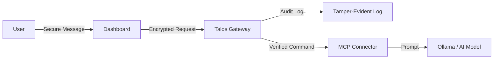
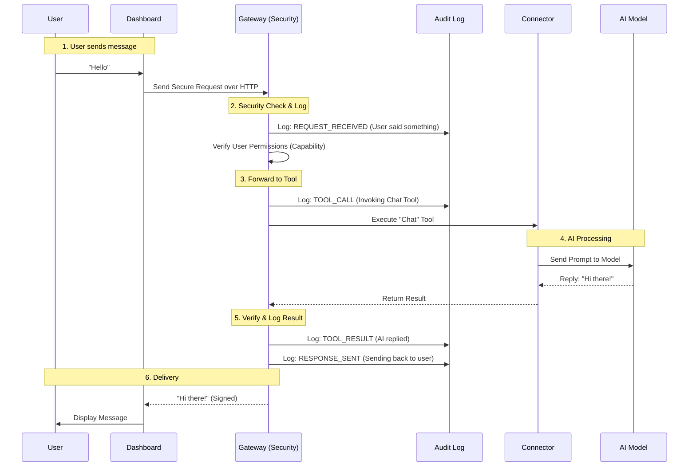

# Simplified Architecture

This document explains the Talos flow using simple diagrams and terminology.

## The "Secure Pipe" Concept
Talos acts as a secure pipe between the User and the AI. Nothing passes through without being stamped and logged.

## detailed Flow: Sending a Message

When you type "Hello" in the chat, here is the behind-the-scenes journey:

## Key Concepts

**Tamper-Evident Audit Log**
A database where every entry is cryptographically linked to the previous one (like a chain). If someone modifies an old entry, the chain breaks, and the system flags it as "Corrupted".

**Capability**
A digital key or ticket that grants permission. The Gateway checks this ticket before allowing any message to pass.

**MCP (Model Context Protocol)**
The standard language the Gateway uses to talk to tools (like the Chat Tool or a Database Tool). Talos wraps this standard in a security layer.
