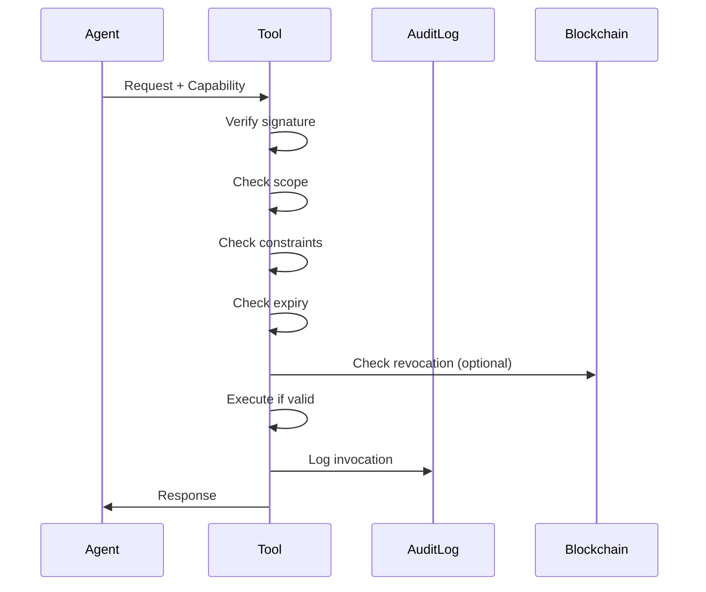

# Agent Capabilities

> **Problem**: Agents need scoped, revocable authorization.  
> **Guarantee**: First-class capability model with explicit separation of concerns.  
> **Non-goal**: General-purpose policy engine—see [Access Control](Access-Control).

---

## The Four-Layer Model

Talos explicitly separates:

```
┌─────────────────────────────────────────────────────────┐
│  1. IDENTITY        Who is making the request?          │
│     ─────────────────────────────────────────────────── │
│     DID, public key, anchor proof                       │
├─────────────────────────────────────────────────────────┤
│  2. AUTHORITY       What are they allowed to do?        │
│     ─────────────────────────────────────────────────── │
│     Capability token, scope, constraints, expiry        │
├─────────────────────────────────────────────────────────┤
│  3. INTENT          What do they claim they want to do? │
│     ─────────────────────────────────────────────────── │
│     Signed intent statement, parameters                 │
├─────────────────────────────────────────────────────────┤
│  4. EXECUTION       What actually happened?             │
│     ─────────────────────────────────────────────────── │
│     Tool output, result hash, execution signature       │
└─────────────────────────────────────────────────────────┘
```

Most systems collapse these. Talos keeps them separate for:
- **Auditability**: Detect when execution diverges from intent
- **Security**: Prove authorization even if logs are compromised
- **Governance**: Policy over each layer independently

---

## Capability Token Structure

```python
@dataclass
class Capability:
    id: str                    # Unique capability ID
    issuer: str                # DID of granting agent
    subject: str               # DID of receiving agent
    scope: str                 # What action is authorized
    constraints: dict          # Rate limits, parameters, etc.
    expires_at: datetime       # When capability ends
    delegatable: bool          # Can be passed to others
    signature: bytes           # Issuer's Ed25519 signature
```

**Example**:
```python
capability = Capability(
    id="cap_7f3k2m4n",
    issuer="did:talos:tool_owner",
    subject="did:talos:my_agent",
    scope="tools/filesystem/read",
    constraints={
        "paths": ["/data/*"],
        "max_size_kb": 1024,
        "rate_limit": "10/minute"
    },
    expires_at=datetime.now() + timedelta(minutes=15),
    delegatable=False
)
```

---

## Granting Capabilities

### Basic Grant

```python
from talos import TalosClient

async with TalosClient.create("tool-owner") as owner:
    # Grant capability to another agent
    capability = await owner.grant_capability(
        subject="did:talos:requesting_agent",
        scope="tools/database/query",
        expires_in=300,  # 5 minutes
        constraints={
            "tables": ["users", "orders"],
            "max_rows": 1000
        }
    )
    
    # Capability is automatically:
    # - Signed by issuer
    # - Logged to audit
    # - Hash anchored (optional)
```

### With Delegation

```python
# Allow recipient to delegate to others
capability = await owner.grant_capability(
    subject="did:talos:coordinator",
    scope="tools/api/call",
    expires_in=3600,
    delegatable=True,
    delegation_depth=2  # Can delegate twice
)
```

---

## Using Capabilities

### Invoking a Tool

```python
async with TalosClient.create("my-agent") as agent:
    # Use capability to invoke tool
    result = await agent.invoke_tool(
        peer_id="did:talos:tool_owner",
        method="filesystem/read",
        params={"path": "/data/config.json"},
        capability=capability
    )
```

### What Happens

1. Agent presents capability token
2. Tool verifies:
   - Signature is valid
   - Issuer is trusted
   - Subject matches caller
   - Scope covers requested action
   - Constraints are satisfied
   - Not expired
   - Not revoked
3. If valid, tool executes
4. Both sides log to audit

---

## Capability Scopes

Scopes follow a hierarchical pattern:

```
tools/                      # All tools
tools/filesystem/           # All filesystem operations
tools/filesystem/read       # Only read operations
tools/filesystem/read#/data # Only /data paths
```

### Scope Examples

| Scope | Meaning |
|-------|---------|
| `tools/*` | All tools |
| `tools/database/query` | Database queries only |
| `tools/api/call#endpoint:users` | Specific API endpoint |
| `mcp/invoke` | Any MCP tool invocation |

---

## Constraints

Constraints limit how a capability can be used:

### Rate Limiting

```python
constraints={
    "rate_limit": "100/hour",
    "burst_limit": 10
}
```

### Parameter Restrictions

```python
constraints={
    "allowed_params": ["path", "encoding"],
    "forbidden_params": ["recursive"],
    "path_patterns": ["/data/*", "/config/*"]
}
```

### Time Windows

```python
constraints={
    "valid_hours": [9, 17],  # 9 AM - 5 PM
    "valid_days": ["mon", "tue", "wed", "thu", "fri"]
}
```

### Environment

```python
constraints={
    "environments": ["production"],
    "regions": ["us-east-1", "eu-west-1"]
}
```

---

## Delegation Chains

Capabilities can be delegated:

```
Owner → Coordinator → Worker Agent
  │         │              │
  │         │              └─ Can use capability
  │         └─ Reduced scope, added constraints
  └─ Original grant
```

### Delegation Rules

1. **Scope can only narrow**: Delegate can't exceed delegator's scope
2. **Constraints can only tighten**: Can't remove constraints
3. **Expiry can only shorten**: Can't extend past original expiry
4. **Depth is tracked**: Prevents infinite delegation

### Example

```python
# Coordinator delegates to worker with reduced scope
delegated = await coordinator.delegate_capability(
    original=capability,
    subject="did:talos:worker_1",
    scope="tools/database/query#tables:users",  # Narrower
    expires_in=60,  # Shorter
    additional_constraints={"max_rows": 100}  # Tighter
)
```

---

## Revocation

### Immediate Revocation

```python
await owner.revoke_capability(capability.id, reason="security incident")
```

### What Happens

1. Revocation logged to audit
2. Revocation anchored on-chain (if enabled)
3. Active capability checks reject it

### Revocation Propagation

- Local: Immediate
- Peers: Next sync (seconds)
- Blockchain: Next anchor (minutes)

### Defensive Design

- **Default to leases**: Short-lived capabilities by default
- **Check freshness**: Tools verify revocation list
- **Fail closed**: If revocation check fails, deny

---

## Capability Leasing

Best practice: **lease, don't grant permanently**.

```python
# Good: 15-minute lease, renewable
capability = await owner.grant_capability(
    subject=agent_id,
    scope="tools/api/call",
    expires_in=900,  # 15 minutes
    renewable=True
)

# Agent renews before expiry
renewed = await agent.renew_capability(capability.id)
```

Benefits:
- Limits blast radius
- Forces re-authorization
- Matches enterprise expectations

---

## Verification Flow



---

## Intent Statements (Advanced)

For high-risk operations, Talos supports **intent statements**:

```python
# Create signed intent before execution
intent = await agent.create_intent(
    action="transfer_funds",
    params={"amount": 1000, "to": "account_xyz"},
    justification="Monthly payment to vendor"
)

# Include intent with capability
result = await agent.invoke_tool(
    method="banking/transfer",
    params=intent.params,
    capability=capability,
    intent=intent
)
```

Intent artifacts are:
- Signed before execution
- Logged to audit
- Comparable to execution results
- Useful for governance and disputes

---

## CLI Commands

```bash
# List active capabilities
talos capabilities list

# Grant a capability
talos capabilities grant \
  --subject did:talos:agent_xyz \
  --scope "tools/filesystem/read" \
  --expires 15m

# Revoke a capability
talos capabilities revoke cap_7f3k2m4n --reason "no longer needed"

# Check capability status
talos capabilities verify cap_7f3k2m4n
```

---

## Best Practices

| Practice | Rationale |
|----------|-----------|
| Use leases, not permanent grants | Limits blast radius |
| Scope as narrowly as possible | Least privilege |
| Add rate limits | Prevent abuse |
| Make non-delegatable by default | Control chain |
| Log all grants and uses | Auditability |
| Check revocation on hot path | Defense in depth |

---

**See also**: [Agent Lifecycle](Agent-Lifecycle) | [Access Control](Access-Control) | [MCP Cookbook](MCP-Cookbook)
