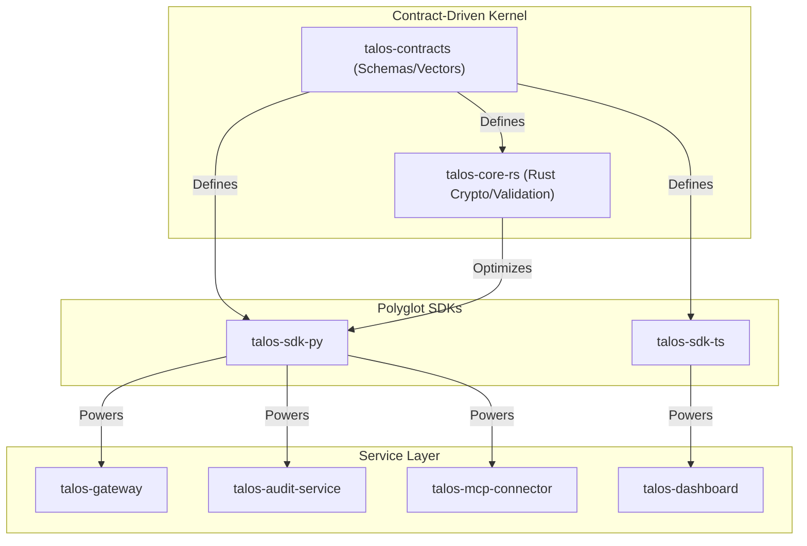

# Architecture Overview

## High-Level Design (v4.0)

Talos v4.0 adopts a **Contract-Driven Kernel** architecture using **Ports & Adapters (Hexagonal)** pattern.



## Component Details

### 1. Contracts (`talos-contracts`)

**The Single Source of Truth.**

- **Language**: JSON / TypeScript / Python
- **Responsibilities**: Defines Schemas, Test Vectors, and standard helper functions (Cursors, UUIDv7).
- **Artifacts**: `@talosprotocol/contracts` (NPM), `talos-contracts` (PyPI), `test_vectors.tar.gz`.

### 2. Rust Kernel (`talos-core-rs`)

**High-Performance Wedge.**

- **Language**: Rust
- **Responsibilities**: Cryptographic primitives (Ed25519, ChaCha20), Block Validation, Merkle Tree operations.
- **Integration**: Exposed to Python via PyO3/Maturin.

### 3. SDKs (Ports & Adapters)

**Business Logic & Glue.**

- **`talos-sdk-py`**: Python implementation of Use-Case Ports (Storage, Crypto, Hash) and Adapters (LMDB, HTTP, MCP).
- **`talos-sdk-ts`**: TypeScript equivalent for Node.js and Browser environments.

### 4. Services

- **`talos-gateway`**: FastAPI entry point for the network.
- **`talos-audit-service`**: Dedicated audit log aggregator and query engine.
- **`talos-mcp-connector`**: Secure bridge for AI Agents to strictly typed internal tools.
- **`talos-dashboard`**: Visual security console for verifying audit proofs.

## Data Flow

### Sending a Message

```
User Input → Client → TransmissionEngine
                          │
                          ▼
                    ┌─────────────┐
                    │ Get Shared  │
                    │   Secret    │
                    └─────────────┘
                          │
                          ▼
                    ┌─────────────┐
                    │  Encrypt    │
                    │  Content    │
                    └─────────────┘
                          │
                          ▼
                    ┌─────────────┐
                    │    Sign     │
                    │  Payload    │
                    └─────────────┘
                          │
                          ▼
                    ┌─────────────┐
                    │ Add to      │
                    │ Blockchain  │
                    └─────────────┘
                          │
                          ▼
                    ┌─────────────┐
                    │ Send via    │
                    │   P2P       │
                    └─────────────┘
```

### Receiving a Message

```
P2P Layer → TransmissionEngine
                   │
                   ▼
             ┌─────────────┐
             │   Verify    │
             │  Signature  │
             └─────────────┘
                   │
                   ▼
             ┌─────────────┐
             │  Decrypt    │
             │  Content    │
             └─────────────┘
                   │
                   ▼
             ┌─────────────┐
             │ Record to   │
             │ Blockchain  │
             └─────────────┘
                   │
                   ▼
             ┌─────────────┐
             │   Invoke    │
             │  Callbacks  │
             └─────────────┘
                   │
                   ▼
             ┌─────────────┐
             │  Send ACK   │
             └─────────────┘
```

## File Structure

```
blockchain-messaging-protocol/
├── src/
│   ├── core/
│   │   ├── blockchain.py    # Blockchain + Block + MerkleProof
│   │   ├── crypto.py        # Cryptographic primitives
│   │   ├── message.py       # Message types and payload
│   │   └── sync.py          # Chain synchronization
│   ├── engine/
│   │   ├── engine.py        # TransmissionEngine
│   │   ├── chunker.py       # Data chunking
│   │   └── media.py         # File transfer
│   ├── network/
│   │   ├── p2p.py           # P2P networking
│   │   └── pool.py          # Connection pooling
│   ├── client/
│   │   ├── client.py        # High-level client
│   │   └── cli.py           # Command-line interface
│   └── server/
│       └── registry.py      # Registry server
├── tests/                   # 122 unit tests
├── benchmarks/              # Performance benchmarks
└── docs/                    # Documentation
```

## Design Decisions

### Why WebSocket over TCP?

- Bidirectional communication without polling
- Built-in framing (no manual packet handling)
- Easy upgrade path to WebRTC for real-time media

### Why Lightweight PoW?

- Prevents spam without expensive consensus
- Each node maintains local chain (no global agreement needed)
- Configurable difficulty for different use cases

### Why Ed25519 + X25519?

- Modern curves with 128-bit security
- Small keys (32 bytes) and signatures (64 bytes)
- Fast operations (~8k ops/s for sign+verify)

### Why ChaCha20-Poly1305?

- Same cipher as TLS 1.3
- 450 MB/s+ encryption speed
- Authenticated encryption (integrity + confidentiality)
