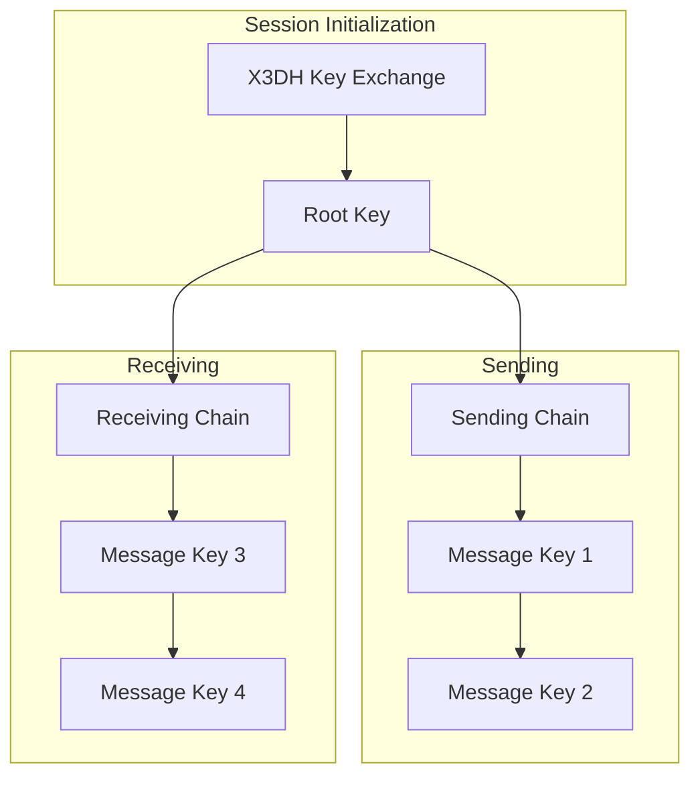

# Double Ratchet Protocol

> **Perfect Forward Secrecy for Every Message**

## Overview

The Double Ratchet Protocol provides end-to-end encryption with **forward secrecy** and **break-in recovery**. Based on the [Signal Protocol specification](https://signal.org/docs/specifications/doubleratchet/), it ensures that:

- **Forward Secrecy**: Compromised keys cannot decrypt past messages
- **Break-in Recovery**: Sessions heal after temporary key compromise
- **Per-Message Keys**: Each message uses a unique encryption key

## Architecture



---

## Quick Start

### 1. Create Session Manager

```python
from src.core.session import SessionManager
from src.core.crypto import generate_signing_keypair

# Each peer has an identity key pair
identity = generate_signing_keypair()
manager = SessionManager(identity)
```

### 2. Publish Prekey Bundle

```python
# Get bundle to share with others
bundle = manager.get_prekey_bundle()

# Publish to registry/DHT
registry.publish_prekeys(my_id, bundle.to_dict())
```

### 3. Establish Session (Initiator)

```python
# Fetch peer's prekey bundle
peer_bundle = PrekeyBundle.from_dict(registry.get_prekeys(peer_id))

# Create session
session = manager.create_session_as_initiator(peer_id, peer_bundle)

# Encrypt message (keys ratchet forward)
encrypted = session.encrypt(b"Hello, World!")
```

### 4. Receive Message (Responder)

```python
# Extract header from first message
header = MessageHeader.from_bytes(encrypted[2:...])

# Create session
session = manager.create_session_as_responder(
    sender_id,
    header.dh_public,
    sender_identity,
)

# Decrypt
plaintext = session.decrypt(encrypted)
```

---

## Key Components

### X3DH Handshake

Extended Triple Diffie-Hellman establishes initial shared secrets:

```
Alice                           Bob
  │                               │
  │ Get Bob's prekey bundle       │
  │<──────────────────────────────│
  │                               │
  │ Generate ephemeral key        │
  │ DH(ephemeral, Bob's SPK)      │
  │                               │
  │ First message + ephemeral     │
  │──────────────────────────────>│
  │                               │
  │         Bob derives same keys │
  │         using his SPK         │
```

### Prekey Bundle

Published for others to establish sessions:

```python
@dataclass
class PrekeyBundle:
    identity_key: bytes      # Long-term Ed25519 public key
    signed_prekey: bytes     # X25519 public key  
    prekey_signature: bytes  # Signature over SPK
    one_time_prekey: bytes   # Optional ephemeral (extra security)
```

### Ratchet State

Each session maintains:

| State | Description |
|-------|-------------|
| `dh_keypair` | Current DH key pair |
| `dh_remote` | Peer's current DH public key |
| `root_key` | Secret for deriving chains |
| `chain_key_send` | Current sending chain |
| `chain_key_recv` | Current receiving chain |
| `skipped_keys` | For out-of-order messages |

---

## How Ratcheting Works

### Symmetric Ratchet (Same Direction)

For consecutive messages in the same direction:

```
Chain Key(n) --> KDF --> Message Key(n) + Chain Key(n+1)
```

Each message uses a unique key, old keys are deleted.

### DH Ratchet (Direction Change)

When receiving a reply with new DH key:

```
1. DH(our_private, their_new_public) = shared
2. RootKey, ReceiveChain = KDF_RK(RootKey, shared)
3. Generate new DH key pair
4. DH(new_private, their_public) = shared2
5. RootKey, SendChain = KDF_RK(RootKey, shared2)
```

This provides break-in recovery: even if current keys leak, new ratchet step restores security.

---

## Message Format

```
┌─────────────────────┬──────────────────────┐
│ Header Length (2B)  │                      │
├─────────────────────┤      Ciphertext      │
│ Header (variable)   │   (ChaCha20-Poly1305)│
│  - DH public key    │                      │
│  - Chain length     │                      │
│  - Message number   │                      │
└─────────────────────┴──────────────────────┘
```

### Header Structure

```json
{
  "dh": "base64(sender_dh_public)",
  "pn": 5,  // Previous chain length
  "n": 3    // Message number in current chain
}
```

---

## Out-of-Order Messages

Messages may arrive out of order. Skipped message keys are cached:

```python
# If message 5 arrives before message 3:
# Keys for messages 3, 4 are derived and cached

skipped_keys = {
    (dh_public, 3): key_3,
    (dh_public, 4): key_4,
}
```

Maximum skip: 1000 messages (prevents DoS).

---

## Session Persistence

Sessions can be saved and loaded:

```python
# Save to disk
manager = SessionManager(identity, Path("~/.talos/sessions.json"))
manager.save()

# Load on restart
manager.load()
assert manager.has_session("peer_id")
```

---

## Security Properties

| Property | Guarantee |
|----------|-----------|
| **Confidentiality** | Only recipient can decrypt |
| **Authenticity** | Messages are signed |
| **Forward Secrecy** | Past messages safe if keys leak |
| **Break-in Recovery** | Future messages safe after ratchet |
| **Replay Protection** | Message numbers prevent replay |

---

## API Reference

### SessionManager

```python
class SessionManager:
    def get_prekey_bundle(self) -> PrekeyBundle
    def create_session_as_initiator(peer_id, bundle) -> Session
    def create_session_as_responder(peer_id, dh_public, identity) -> Session
    def get_session(peer_id) -> Optional[Session]
    def has_session(peer_id) -> bool
    def remove_session(peer_id) -> bool
    def save() -> None
    def load() -> None
```

### Session

```python
class Session:
    def encrypt(plaintext: bytes) -> bytes
    def decrypt(message: bytes) -> bytes
    def to_dict() -> dict
    @classmethod from_dict(data) -> Session
```

---

## See Also

- [Cryptography Guide](Cryptography.md) - Underlying primitives
- [Access Control](Access-Control.md) - Permission management
- [Mathematical Security Proof](Mathematical-Security-Proof.md) - Formal guarantees
