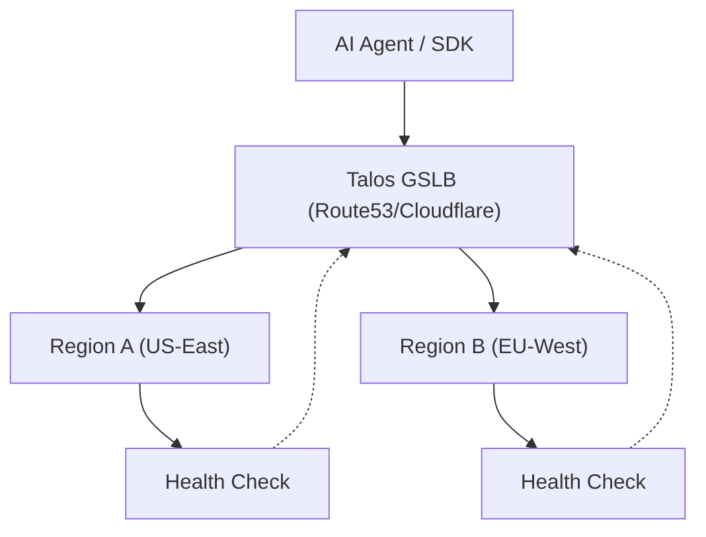

# Global Load Balancing (Phase 14)

Talos implements Global Load Balancing (GSLB) to route agent traffic to the nearest healthy region.

## Features

- **Geographic Routing**: Route traffic based on client IP geolocation.
- **Latency-Based Selection**: Dynamically select regions with the lowest RTT.
- **Failover Automation**: Automatically redirect traffic if a regional gateway becomes unhealthy.

## Architecture



## Configuration

GSLB is configured via the infrastructure layer (Terraform/Pulumi) but integrated into the Gateway health checks.

### Health Endpoints

- `/health/live`: Basic liveness (is the process running?).
- `/health/ready`: Dependency readiness (is DB/Redis reachable?).

## Verification

The GSLB setup is verified using the `tests/test_gslb.py` suite, which simulates requests from various geographic regions and validates the routing logic.

```bash
uv run pytest tests/test_gslb.py
```

## Related

- [Multi-Region Architecture](Multi-Region)
- [Observability](Observability)
