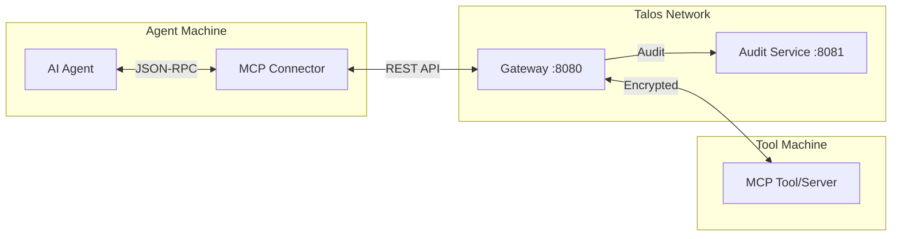

# Model Context Protocol (MCP) Integration

> **Secure, Decentralized Transport for AI Tools**

## Overview

The MCP Connector (`talos-mcp-connector`) bridges the Model Context Protocol with Talos secure messaging. It allows AI Agents to securely access tools on remote machines without centralized servers.

## Repository

| Component | Location |
|-----------|----------|
| **MCP Connector** | `deploy/repos/talos-mcp-connector/` |
| **Gateway API** | `deploy/repos/talos-gateway/` |

## Architecture



## Quick Start

### 1. Start Services

```bash
./deploy/scripts/start_all.sh
```

Services started:
- Gateway: `http://localhost:8080`
- MCP Connector: `http://localhost:8082`
- Audit Service: `http://localhost:8081`

### 2. Check Status

```bash
curl http://localhost:8082/api/mcp/status
```

### 3. List Available Tools

```bash
curl http://localhost:8082/api/mcp/tools
```

## API Endpoints

| Endpoint | Method | Description |
|----------|--------|-------------|
| `/health` | GET | Health check |
| `/api/mcp/status` | GET | Connector status |
| `/api/mcp/tools` | GET | List available tools |
| `/api/mcp/invoke` | POST | Invoke MCP method |

## Security Model

Security is inherited from Talos Protocol:

1. **Authentication**: Ed25519 public keys
2. **Encryption**: ChaCha20-Poly1305
3. **Integrity**: All messages signed and audited
4. **Privacy**: P2P, no centralized server

## Configuration

### Environment Variables

| Variable | Default | Description |
|----------|---------|-------------|
| `TALOS_MCP_PORT` | `8082` | Connector port |
| `TALOS_GATEWAY_URL` | `http://localhost:8080` | Gateway endpoint |
| `TALOS_ENV` | `production` | Environment |

### Claude Desktop Integration

```json
{
  "mcpServers": {
    "talos": {
      "command": "curl",
      "args": ["-X", "POST", "http://localhost:8082/api/mcp/invoke"]
    }
  }
}
```

## Development

```bash
cd deploy/repos/talos-mcp-connector

make install    # Install dependencies
make test       # Run tests
make start      # Start service
make stop       # Stop service
```

## Troubleshooting

| Issue | Solution |
|-------|----------|
| Connection timeout | Ensure Gateway is running on :8080 |
| 404 errors | Check MCP connector is on :8082 |
| Auth failures | Verify capability tokens |

## See Also

- [MCP Cookbook](MCP-Cookbook) - Recipes and examples
- [MCP Proof Flow](MCP-Proof-Flow) - Audit proof verification
- [Gateway API](API-Reference) - Full API reference
