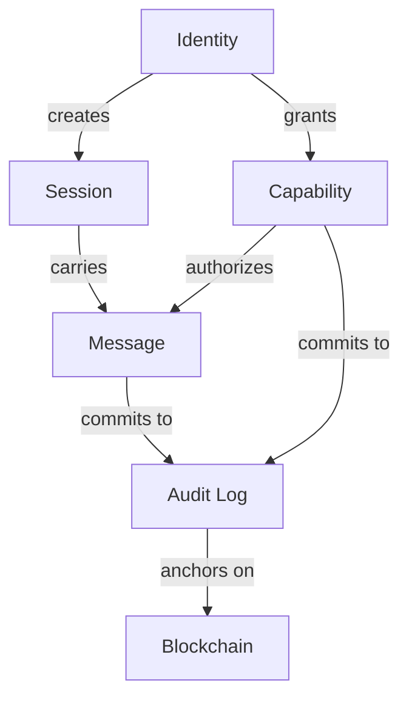

# Talos Mental Model

> **Problem**: Readers understand pieces but not the whole.  
> **Guarantee**: One abstraction that ties everything together.  
> **Non-goal**: Technical details—see individual pages for those.

## The Core Abstraction

**Talos is a graph of identities where edges are encrypted sessions, capabilities constrain actions, and audit commits facts.**

```
            ┌─────────────────────────────────────────┐
            │            Talos Network                │
            │                                         │
            │    ┌─────────┐         ┌─────────┐     │
            │    │ Agent A │◄───────►│ Agent B │     │
            │    └────┬────┘ session └────┬────┘     │
            │         │                   │          │
            │         │    capability     │          │
            │         │    ┌───────┐      │          │
            │         └───►│ Tool  │◄─────┘          │
            │              └───┬───┘                 │
            │                  │                     │
            │              ┌───┴───┐                 │
            │              │ Audit │                 │
            │              │  Log  │                 │
            │              └───────┘                 │
            └─────────────────────────────────────────┘
```

## Five Concepts, One System

### 1. Identity

Every agent has a cryptographic identity:
- **Keypair**: Ed25519 for signing, X25519 for encryption
- **Peer ID**: Unique identifier derived from public key
- **DID**: Decentralized Identifier (optional, anchored on-chain)

Identity is **permanent** unless explicitly revoked.

### 2. Sessions

When two identities want to communicate:
- Exchange **prekey bundles**
- Establish **Double Ratchet session**
- Every message rotates keys → **forward secrecy**

Sessions are **ephemeral**—they can be re-established if lost.

### 3. Capabilities

Not every agent can do everything:
- **Scope**: What resource/action is authorized
- **Constraints**: Rate limits, parameter restrictions
- **Expiry**: When the capability ends
- **Delegation**: Can be passed to other agents

Capabilities are **granted, scoped, and revocable**.

### 4. Messages

Agents exchange encrypted payloads:
- **Confidential**: Only recipient can decrypt
- **Authenticated**: Signed by sender
- **Ordered**: Blockchain provides global ordering

Messages are **private but provable**.

### 5. Audit

Every significant event is committed:
- Message hashes
- Capability grants
- Session establishments
- Revocations

Audit log is **append-only, Merkle-proofed, blockchain-anchored**.

## How They Relate



## The Flow

1. **Agent A** has an identity
2. **Agent A** establishes a session with **Agent B**
3. **Agent B** grants **Agent A** a capability to invoke **Tool C**
4. **Agent A** sends a message invoking **Tool C** over the session
5. **Tool C** verifies the capability and executes
6. All events are committed to the **audit log**
7. Periodically, audit roots are anchored to the **blockchain**

## What Lives Where

| Component | Location | Persistence |
|-----------|----------|-------------|
| Identity keys | Agent local storage | Permanent |
| Session state | Agent memory | Ephemeral |
| Capability tokens | Issued to holders | Until expiry/revocation |
| Messages | Encrypted in transit | Not stored (unless by recipient) |
| Audit log | Agent local chain | Permanent |
| Trust anchors | Blockchain | Permanent |

## Key Insight

> **Talos separates what you can prove from what you must reveal.**

- You can prove a message was sent without revealing its contents
- You can prove a capability was valid without exposing the token
- You can prove an identity exists without revealing the private key

This is the foundation of **privacy-preserving accountability**.

---

**Next**: [Glossary](Glossary) | [Protocol Guarantees](Protocol-Guarantees) | [Agent Capabilities](Agent-Capabilities)
