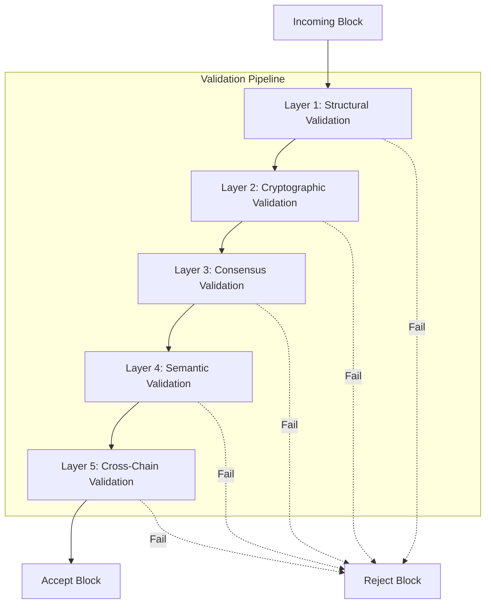

# Block Validation Engine

> **Multi-Layer Security Validation for the Talos Blockchain**

## Overview

The Block Validation Engine is a comprehensive, multi-layer validation system that ensures block integrity at every level. It provides cryptographic proof verification, consensus validation, and semantic checks before any block is accepted into the chain.

## Architecture



## Validation Layers

### Layer 1: Structural Validation

Validates the block's schema, field types, and size constraints.

| Check | Description | Error Code |
|-------|-------------|------------|
| Required Fields | Block must have index, timestamp, data, previous_hash, nonce, hash | `MISSING_FIELD` |
| Type Validation | Index must be non-negative int, timestamp must be numeric | `INVALID_TYPE` |
| Size Limits | Block size ≤ 1MB, single item ≤ 100KB | `SIZE_EXCEEDED` |

### Layer 2: Cryptographic Validation

Verifies hash integrity, Merkle roots, and message signatures.

| Check | Algorithm | Error Code |
|-------|-----------|------------|
| Block Hash | SHA-256 of block content | `HASH_MISMATCH` |
| Merkle Root | Binary Merkle tree of messages | `MERKLE_INVALID` |
| Signatures | Ed25519 batch verification | `SIGNATURE_INVALID` |

### Layer 3: Consensus Validation

Enforces Proof of Work and chain continuity rules.

| Check | Description | Error Code |
|-------|-------------|------------|
| PoW Target | Hash must have `difficulty` leading zeros | `POW_INVALID` |
| Timestamp | Block time ≤ current time + 5 min | `TIMESTAMP_INVALID` |
| Chain Link | `previous_hash` must match parent block | `CHAIN_LINK_BROKEN` |
| Index Sequence | Index must be `parent.index + 1` | `CHAIN_LINK_BROKEN` |

### Layer 4: Semantic Validation

Detects duplicates, replay attacks, and format issues.

| Check | Description | Error Code |
|-------|-------------|------------|
| Duplicate Messages | No repeated message IDs | `DUPLICATE_MESSAGE` |
| Nonce Reuse | No sender reuses a nonce | `NONCE_REUSED` |
| Message Format | Messages must be valid dicts | `MESSAGE_FORMAT_INVALID` |

### Layer 5: Cross-Chain Validation (Future)

Verifies external blockchain anchors for multi-chain proof.

| Chain | Verification Method |
|-------|---------------------|
| Ethereum | Verify Merkle root in smart contract |
| Solana | Read memo instruction |
| Bitcoin | Check Taproot commitment |

---

## Usage

### Basic Validation

```python
from src.core.validation import ValidationEngine, ValidationLevel

# Create engine with difficulty 2
engine = ValidationEngine(difficulty=2, strict_mode=True)

# Validate a single block
result = await engine.validate_block(block, previous_block=prev_block)

if result.is_valid:
    chain.append(block)
else:
    for error in result.errors:
        print(f"[{error.layer}] {error.code.name}: {error.message}")
```

### Chain Validation

```python
# Validate entire chain
result = await engine.validate_chain(blocks, from_genesis=True)

print(f"Valid: {result.is_valid}")
print(f"Duration: {result.duration_ms:.2f}ms")
```

### Validation Levels

| Level | Layers Checked | Use Case |
|-------|---------------|----------|
| `MINIMAL` | Hash only | Fast sync |
| `STANDARD` | Hash + PoW + Chain link | Normal operation |
| `STRICT` | All 4 layers | Production (default) |
| `PARANOID` | All 5 layers | Cross-chain verification |

---

## Audit Reports

Generate detailed validation reports for compliance and debugging:

```python
from src.core.validation import generate_audit_report

result = await engine.validate_block(block)
report = generate_audit_report(block, result)

# Output formats
print(report.to_json())   # JSON format
print(report.to_markdown())  # Markdown format
```

### Sample Report

```json
{
  "report_id": "abc123...",
  "is_valid": true,
  "duration_ms": 1.23,
  "layer_results": {
    "structural": {"passed": true},
    "cryptographic": {"passed": true},
    "consensus": {"passed": true},
    "semantic": {"passed": true}
  },
  "cryptographic": {
    "hash_verified": true,
    "merkle_verified": true,
    "pow_verified": true
  }
}
```

---

## Metrics

The engine tracks performance metrics:

```python
metrics = engine.get_metrics()
print(f"Blocks validated: {metrics['blocks_validated']}")
print(f"Rejection rate: {metrics['rejection_rate']:.2%}")
print(f"Avg validation time: {metrics['avg_validation_time_ms']:.2f}ms")
```

### Prometheus Export

```
talos_validation_duration_seconds{layer="cryptographic"} 0.0023
talos_blocks_rejected_total{reason="CRYPTO_INVALID"} 42
talos_signature_verify_rate 7917.5
```

---

## Error Codes Reference

| Code | Range | Description |
|------|-------|-------------|
| `MALFORMED_BLOCK` | 1xx | Structural errors |
| `MISSING_FIELD` | 1xx | Required field missing |
| `HASH_MISMATCH` | 2xx | Cryptographic errors |
| `POW_INVALID` | 3xx | Consensus errors |
| `DUPLICATE_MESSAGE` | 4xx | Semantic errors |
| `ANCHOR_MISMATCH` | 5xx | Cross-chain errors |

---

## See Also

- [Blockchain Design](Blockchain.md) - Core blockchain architecture
- [Cryptography Guide](Cryptography.md) - Cryptographic primitives
- [Mathematical Security Proof](Mathematical-Security-Proof.md) - Formal security proofs
